# My portfolio from Frontend Mentor 🚀 [Smailen5](https://www.frontendmentor.io/profile/Smailen5)

### Trovi altri esercizi non inerenti a Frontend Mentor in react [qui](https://smailen5.github.io/react-esercizi/)

---

---

#### Contact Form [Repository](https://github.com/Smailen5/Frontend-Mentor-Challenge/tree/main/contact-form) - [Live site](https://deft-taiyaki-8b9fbf.netlify.app/)

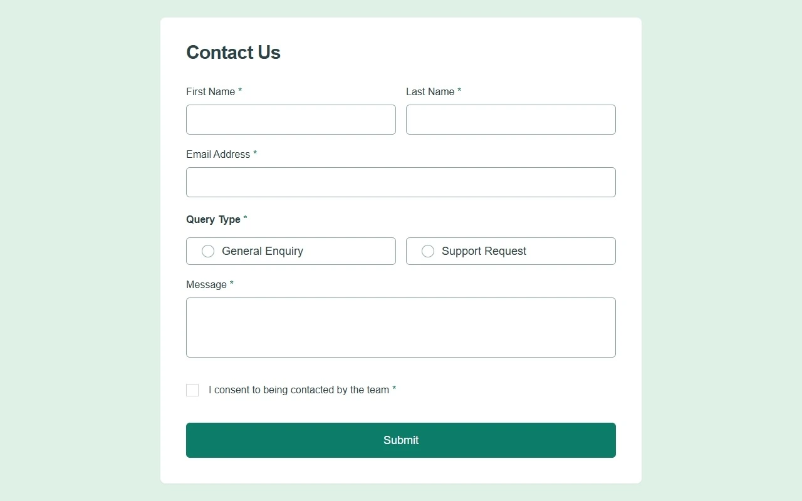

#### Faq Accordion [Repository](https://github.com/Smailen5/Frontend-Mentor-Challenge/tree/main/faq-accordion) - [Live site](https://velvety-pixie-ac034e.netlify.app/)

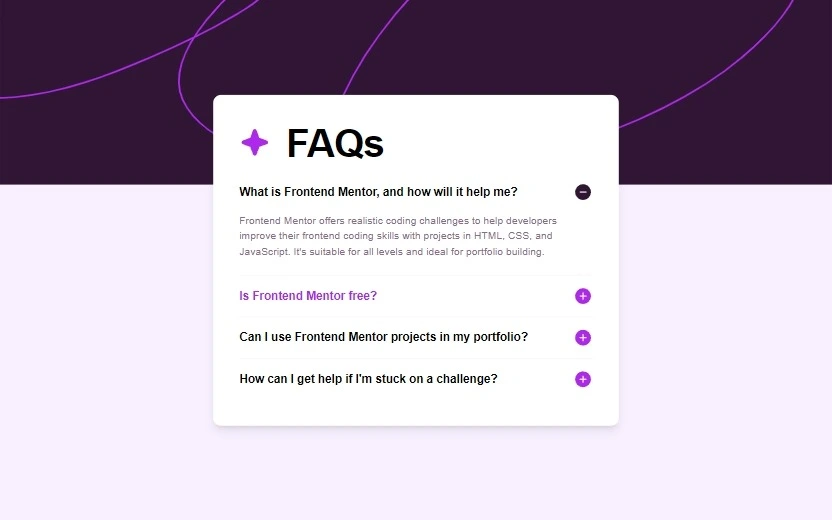

#### Frontend quiz [Repository](https://github.com/Smailen5/Frontend-Mentor-Challenge/tree/main/frontend-quiz-app) - [Live site](https://bejewelled-creponne-01b996.netlify.app/)

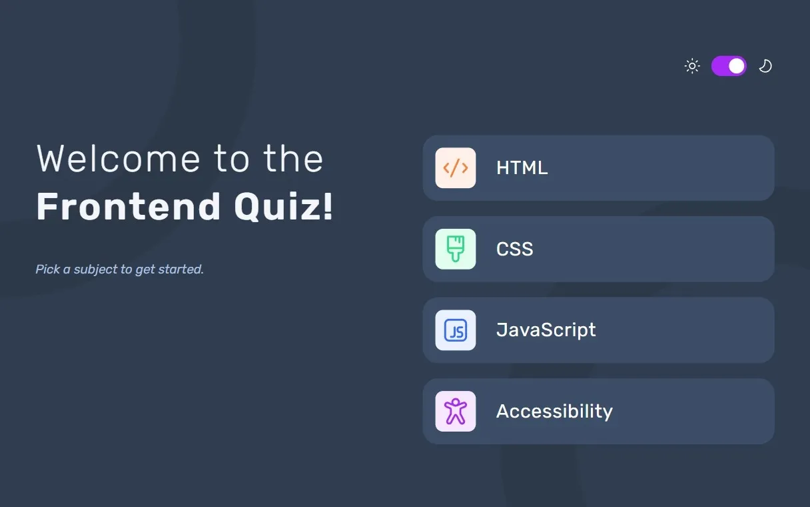

#### Skilled elearning [Repository](https://github.com/Smailen5/Frontend-Mentor-Challenge/tree/main/skilled-elearning-landing-page) - [Live site](https://soft-shortbread-7ebd18.netlify.app/)

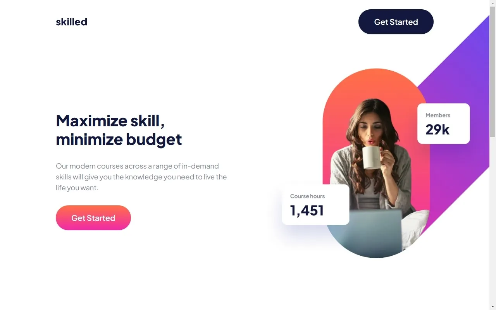

#### Base apparel [Repository](https://github.com/Smailen5/Frontend-Mentor-Challenge/tree/main/base-apparel-coming) - [Live site](https://66b50fe73bacca6322bb5a2a--iridescent-entremet-637a7d.netlify.app/)

#### Single page developer portfolio [Repository](https://github.com/Smailen5/Frontend-Mentor-Challenge/tree/main/single-page-developer-portfolio) - [Live site](https://66acfedd0175d378b05368b4--fanciful-tulumba-14b591.netlify.app/)

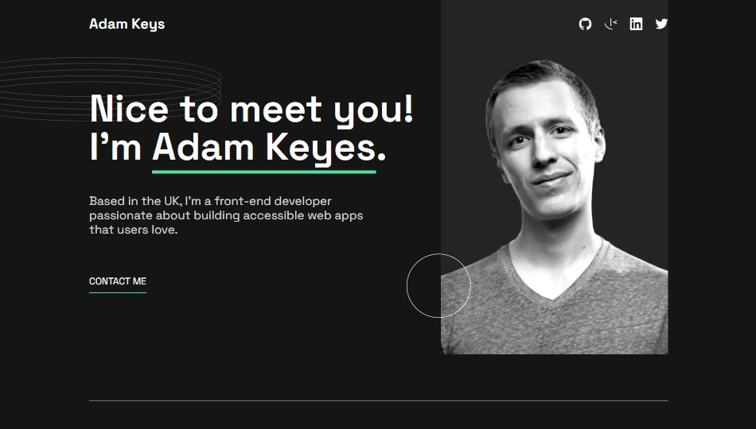

#### Intro component with sign up form (First React App) [Repository](https://github.com/Smailen5/Frontend-Mentor-Challenge/tree/main/component-with-signup-form) - [Live site](https://component-with-sigup-form.netlify.app/)

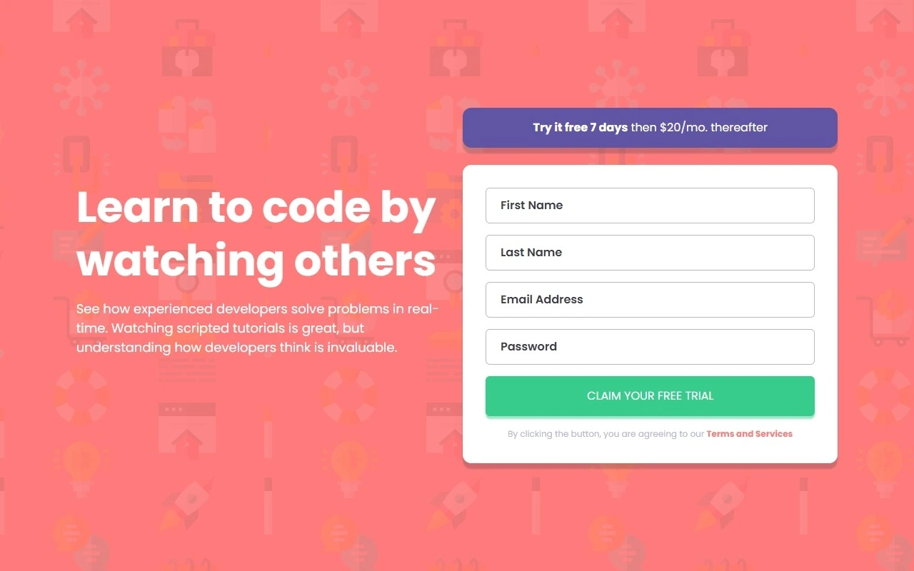

#### Password generator only desktop version [Repository](https://github.com/Smailen5/Frontend-Mentor-Challenge/tree/main/password-generator-app) - [Live site](https://smailen5.github.io/Frontend-Mentor-Challenge/password-generator-app/)

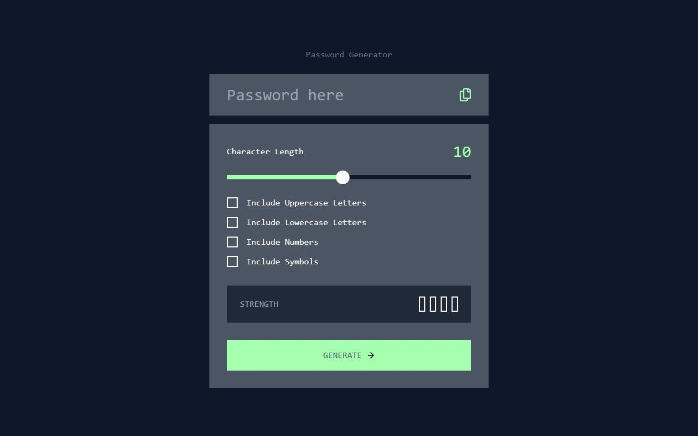

#### Tip calculator [Repository](https://github.com/Smailen5/Frontend-Mentor-Challenge/tree/main/tip-calculator-app-main) - [Live site](https://smailen5.github.io/Frontend-Mentor-Challenge/tip-calculator-app-main/)

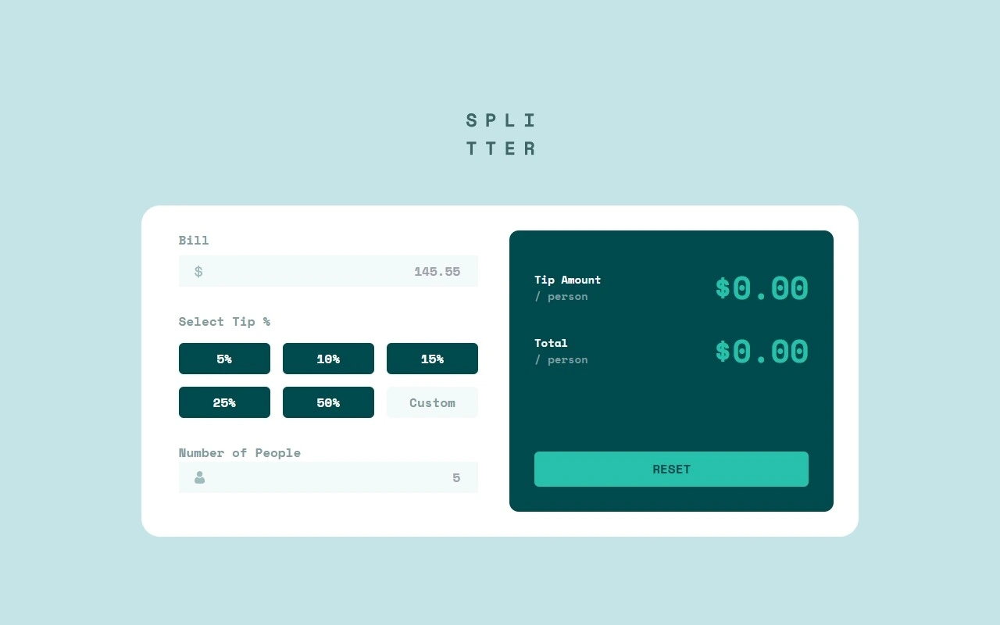

#### Time tracking dashboard [Repository](https://github.com/Smailen5/Frontend-Mentor-Challenge/tree/main/time-tracking-dashboard-main-main) - [Live site](https://smailen5.github.io/Frontend-Mentor-Challenge/time-tracking-dashboard-main-main/)

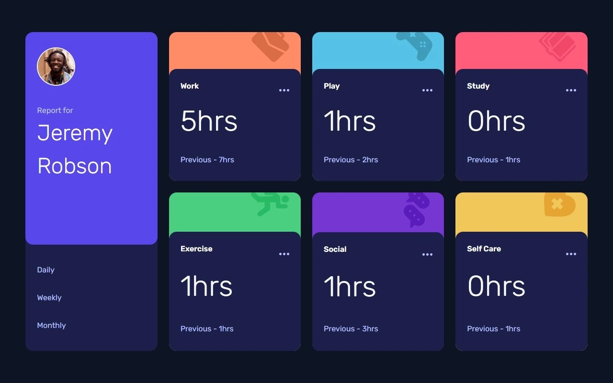

#### QR code [Repository](https://github.com/Smailen5/Frontend-Mentor-Challenge/tree/main/qr-code-component-main-main) - [Live site](https://smailen5.github.io/Frontend-Mentor-Challenge/qr-code-component-main-main/)

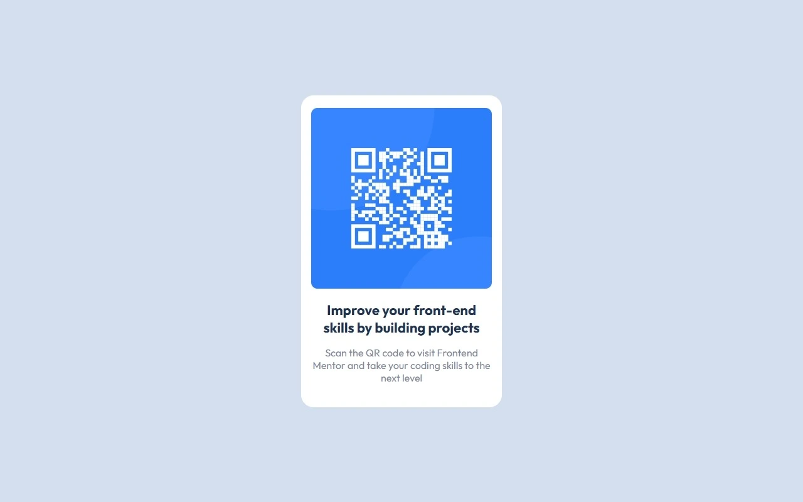

#### 3 column preview card [Repository](https://github.com/Smailen5/Frontend-Mentor-Challenge/tree/main/3-column-preview-card-component-main-main) - [Live site](https://smailen5.github.io/Frontend-Mentor-Challenge/3-column-preview-card-component-main-main/)

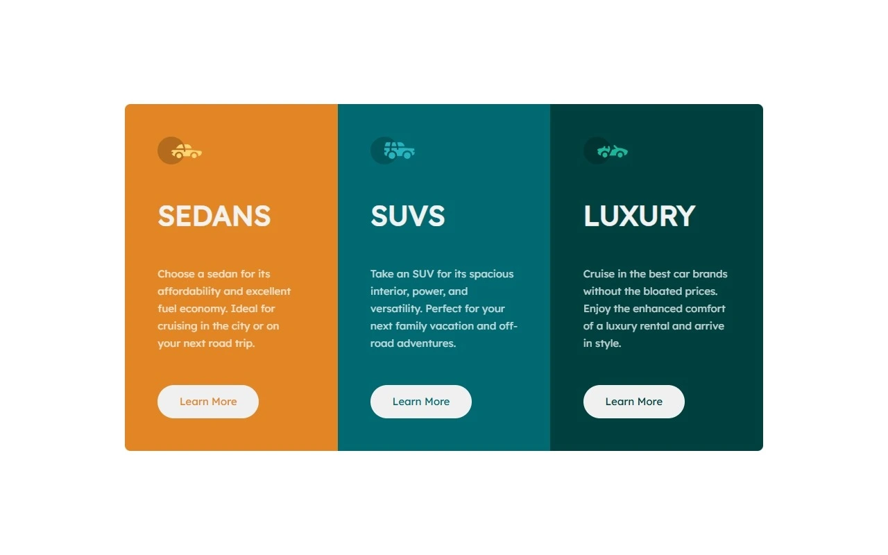

#### article preview component [Repository](https://github.com/Smailen5/Frontend-Mentor-Challenge/tree/main/article-preview-component-master-main) - [Live site](https://smailen5.github.io/Frontend-Mentor-Challenge/article-preview-component-master-main/)

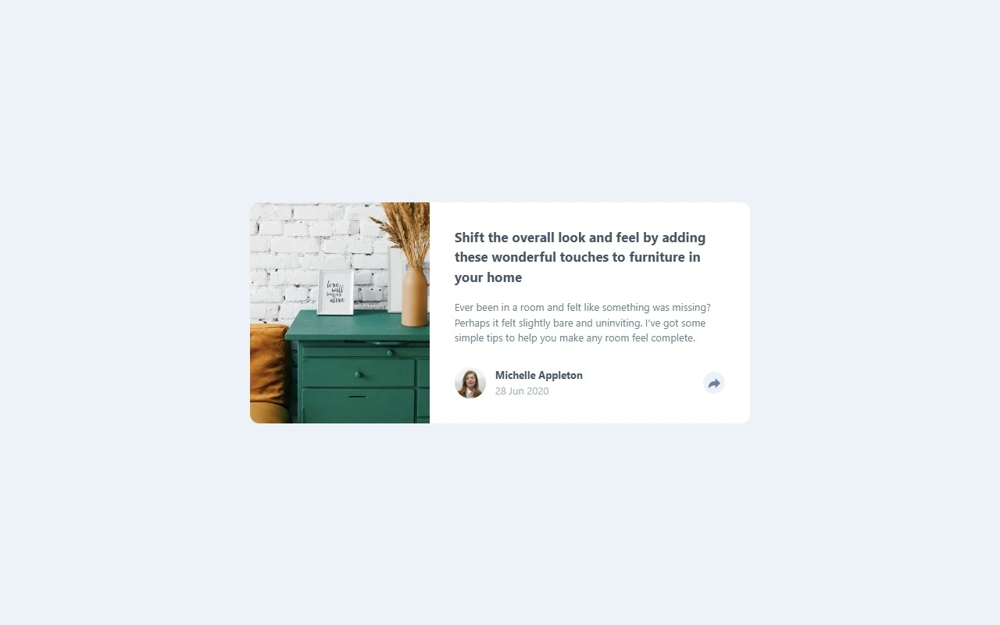

#### blog preview card [Repository](https://github.com/Smailen5/Frontend-Mentor-Challenge/tree/main/blog-preview-card-main-main) - [Live site](https://smailen5.github.io/Frontend-Mentor-Challenge/blog-preview-card-main-main/)

#### four card feature section [Repository](https://github.com/Smailen5/Frontend-Mentor-Challenge/tree/main/four-card-feature-section-master-main) - [Live site](https://smailen5.github.io/Frontend-Mentor-Challenge/four-card-feature-section-master-main/)

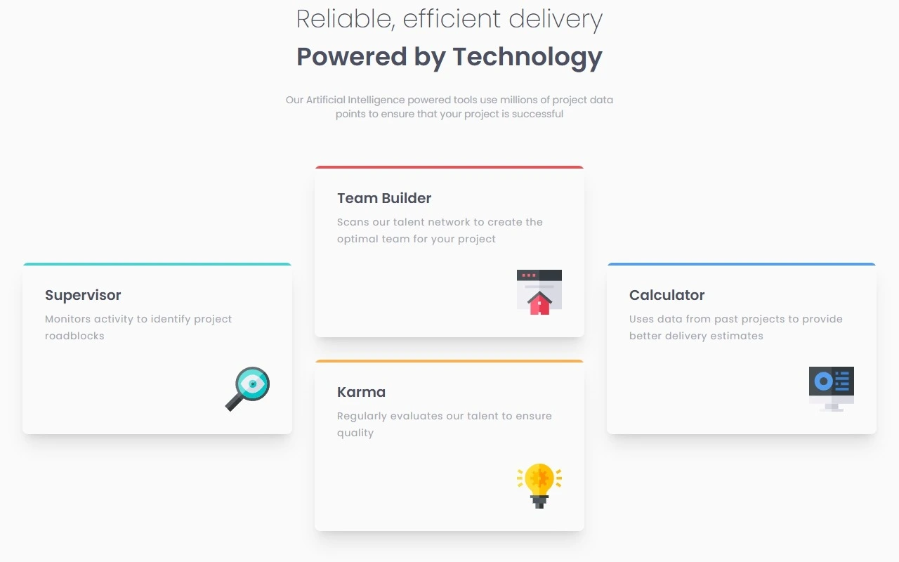

#### interactive rating component [Repository](https://github.com/Smailen5/Frontend-Mentor-Challenge/tree/main/interactive-rating-component-main-main) - [Live site](https://smailen5.github.io/Frontend-Mentor-Challenge/interactive-rating-component-main-main/)

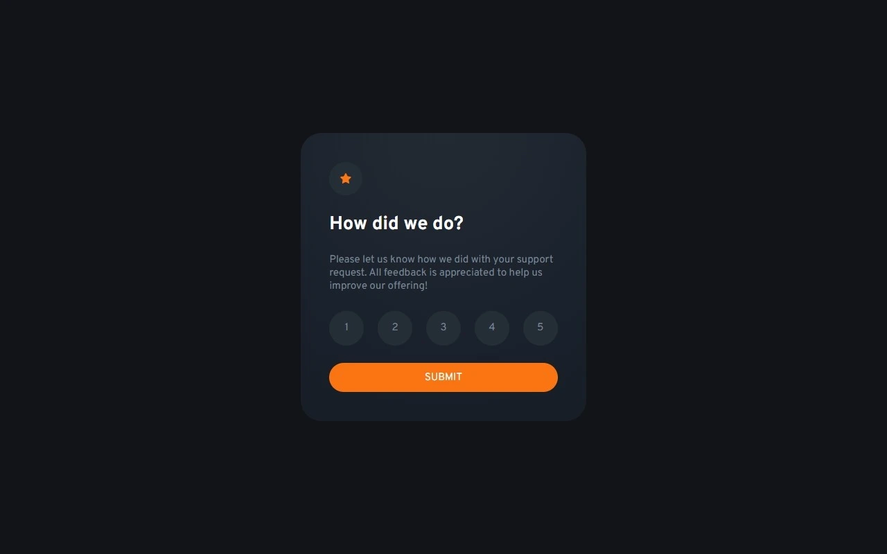

#### meet landing page [Repository](https://github.com/Smailen5/Frontend-Mentor-Challenge/tree/main/meet-landing-page-main) - [Live site](https://smailen5.github.io/Frontend-Mentor-Challenge/meet-landing-page-main/)

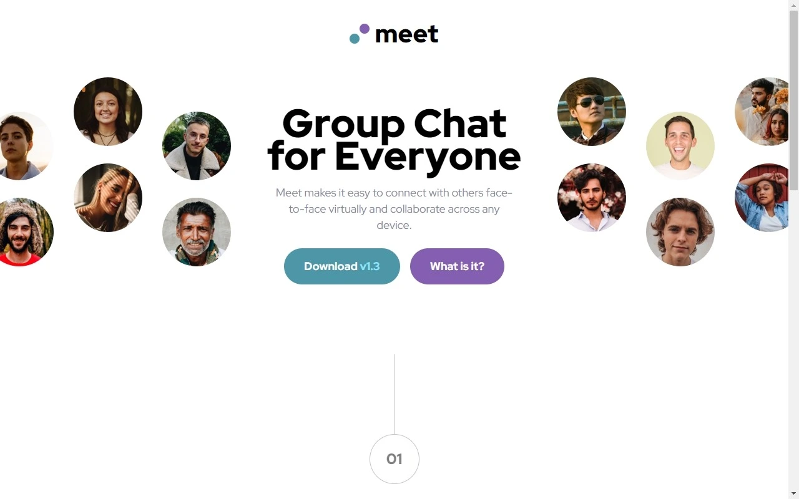

<!-- Il design sembra rotto in desktop ultra wide controlla bene -->
<!-- EDIT: le dimensioni massime della card vanno limitate, in wide e in ultra wide la scheda si allarga troppo -->

#### newsletter sign up with success message [Repository](https://github.com/Smailen5/Frontend-Mentor-Challenge/tree/main/newsletter-sign-up-with-success-message-main-main) - [Live site](https://smailen5.github.io/Frontend-Mentor-Challenge/newsletter-sign-up-with-success-message-main-main/)

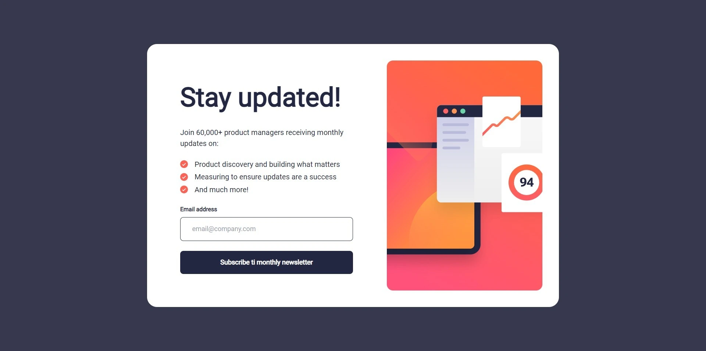

#### nft preview card component [Repository](https://github.com/Smailen5/Frontend-Mentor-Challenge/tree/main/nft-preview-card-component-main-main) - [Live site](https://smailen5.github.io/Frontend-Mentor-Challenge/nft-preview-card-component-main-main/)

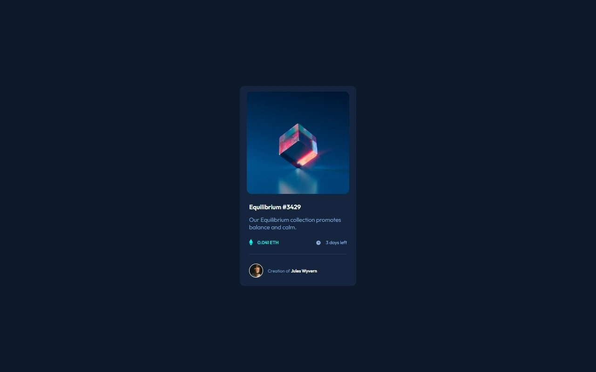

#### order summary component [Repository](https://github.com/Smailen5/Frontend-Mentor-Challenge/tree/main/order-summary-component-main-main) - [Live site](https://smailen5.github.io/Frontend-Mentor-Challenge/order-summary-component-main-main/)

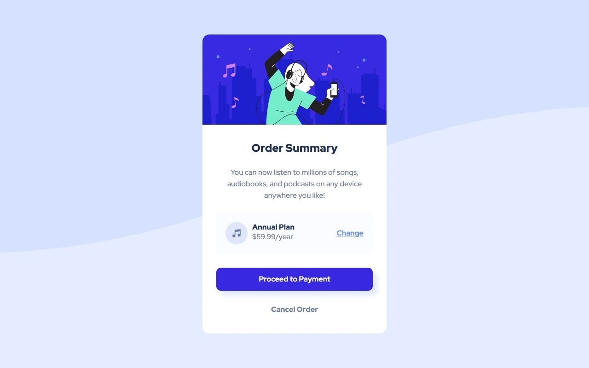

#### pod request access landing page [Repository](https://github.com/Smailen5/Frontend-Mentor-Challenge/tree/main/pod-request-access-landing-page-main) - [Live site](https://smailen5.github.io/Frontend-Mentor-Challenge/pod-request-access-landing-page-main/)

<!-- design rotto in modalita desktop controlla -->
<!-- EDIT: il problema piu che altro risiede nelle media query, il design per smartphone e totalmente sbagliato -->
<!-- #### product preview card component [Repository](https://github.com/Smailen5/Frontend-Mentor-Challenge/tree/main/product-preview-card-component-main-main) - [Live site](https://smailen5.github.io/Frontend-Mentor-Challenge/product-preview-card-component-main-main/) -->

<!--  -->

<!-- sembra non essere posizionato correttamente al centro -->
<!-- EDIT: va riscritto tutto il codice, le misure sono assolute, il design non e responsive, va scritto tutto da capo -->
<!-- #### profile card component [Repository](https://github.com/Smailen5/Frontend-Mentor-Challenge/tree/main/profile-card-component-main-main) - [Live site](https://smailen5.github.io/Frontend-Mentor-Challenge/profile-card-component-main-main/)

 -->

#### recipe page [Repository](https://github.com/Smailen5/Frontend-Mentor-Challenge/tree/main/recipe-page-main-main) - [Live site](https://smailen5.github.io/Frontend-Mentor-Challenge/recipe-page-main-main/)

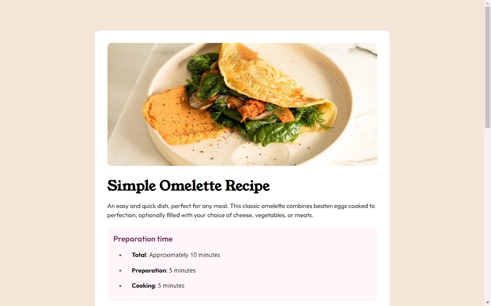

#### results summary component [Repository](https://github.com/Smailen5/Frontend-Mentor-Challenge/tree/main/results-summary-component-main-main) - [Live site](https://smailen5.github.io/Frontend-Mentor-Challenge/results-summary-component-main-main/)

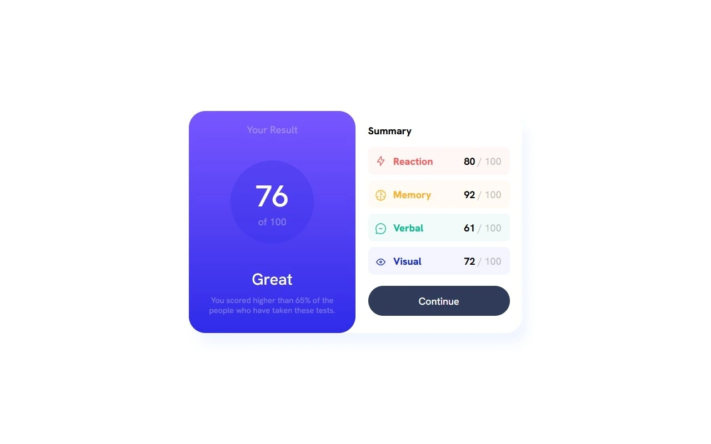

#### social links profile [Repository](https://github.com/Smailen5/Frontend-Mentor-Challenge/tree/main/social-links-profile-main-main) - [Live site](https://smailen5.github.io/Frontend-Mentor-Challenge/social-links-profile-main-main/)

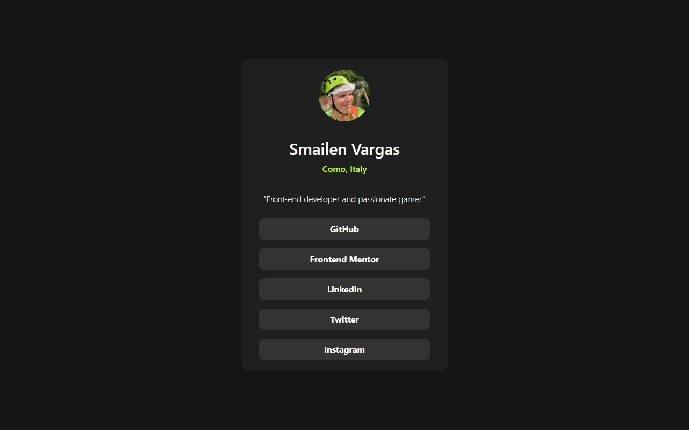

#### social proof section [Repository](https://github.com/Smailen5/Frontend-Mentor-Challenge/tree/main/social-proof-section-master-main) - [Live site](https://smailen5.github.io/Frontend-Mentor-Challenge/social-proof-section-master-main/)

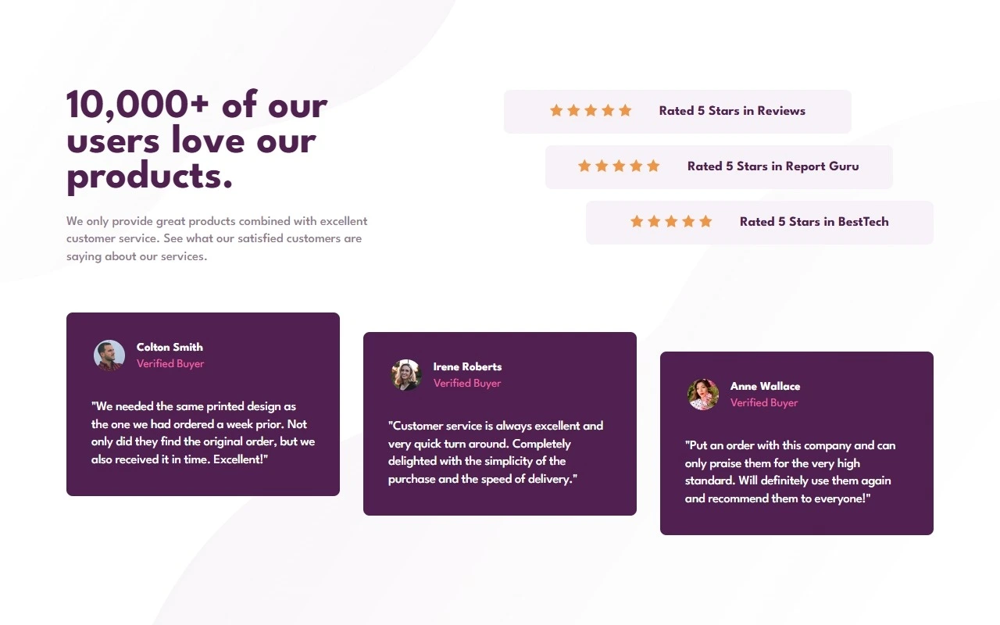

#### stats preview card component [Repository](https://github.com/Smailen5/Frontend-Mentor-Challenge/tree/main/stats-preview-card-component-main-main) - [Live site](https://smailen5.github.io/Frontend-Mentor-Challenge/stats-preview-card-component-main-main/)

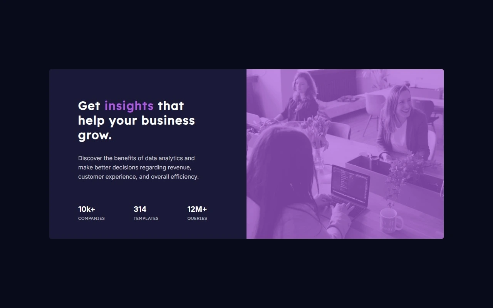

#### testimonials grid section [Repository](https://github.com/Smailen5/Frontend-Mentor-Challenge/tree/main/testimonials-grid-section-main-main) - [Live site](https://smailen5.github.io/Frontend-Mentor-Challenge/testimonials-grid-section-main-main/)

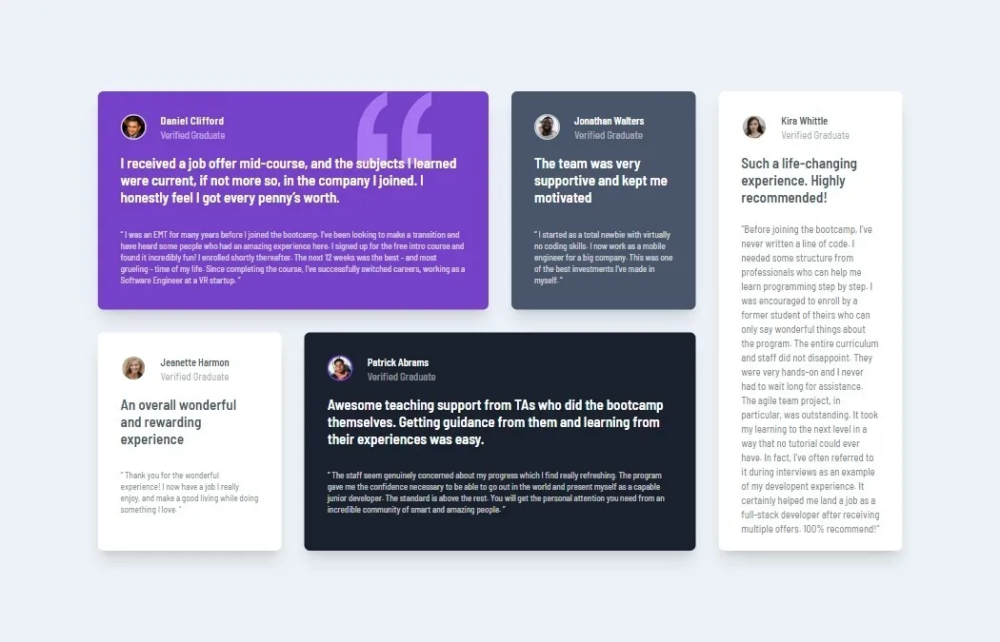

<!-- Questo esercizio e ancora in lavorazione -->
<!-- #### workit landing page [Repository](https://github.com/Smailen5/Frontend-Mentor-Challenge/tree/main/workit-landing-page-main) - [Live site](https://smailen5.github.io/Frontend-Mentor-Challenge/workit-landing-page-main/) -->

## Author

- Website - [Smailen Vargas portfolio](https://smailenvargas.com/)
- Github - [Smailen5](https://github.com/Smailen5)
- Frontend Mentor - [@Smailen5](https://www.frontendmentor.io/profile/Smailen5)
- Linkedin - [Smailen Vargas](https://www.linkedin.com/in/smailen-vargas/)
