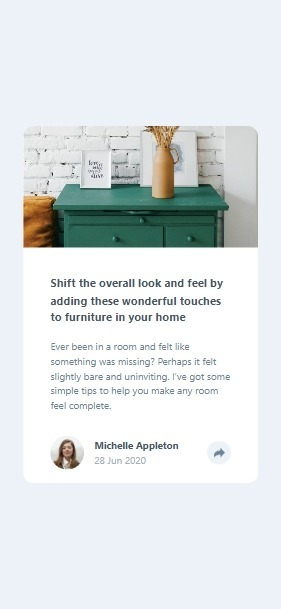

# Article preview component

This is a solution to the [Article preview component challenge on Frontend Mentor](https://www.frontendmentor.io/challenges/article-preview-component-dYBN_pYFT). Frontend Mentor challenges help you improve your coding skills by building realistic projects.


## Overview

### The challenge

Users should be able to:

- View the optimal layout for the component depending on their device's screen size
- See the social media share links when they click the share icon

### Screenshot




### Links

- Solution URL: [Solution](https://github.com/Smailen5/Frontend-Mentor-Challenge/tree/main/article-preview-component-master-main)
- Live Site URL: [Live site](https://smailen5.github.io/Frontend-Mentor-Challenge/article-preview-component-master-main/)

## My process

### Built with

- HTML5
- Mobile-first workflow
- Tailwind
- JavaScript


### What I learned

- To ensure that the social media icons adapt to the container, I learned that I can use `padding-top: 100%;` Unfortunately, this doesn't work with Tailwind. Instead of defining new classes, I decided to use `p-[35%]`, even though it's a fixed measure. It seems that all the images have an appropriate width and height.

```html
<div class="bg-no-repeat bg-contain bg-center p-[35%]"></div>
```

- I had to import an SVG icon from Font Awesome because I couldn't change the color of the provided icon. I probably could have used the `fill-*` class. Once finished, I'll try this approach: `lg:hover:fill-Light-Grayish-Blue`. It doesn't work; probably these icons don't support color modification.

```html
<i class="fa-solid fa-share invert scale-125"></i>
```

- I gave the main container of the card after the body `lg:w-[52%]` because it was the one that best adapted to the actual width. When using Tailwind, the only possible dimensions are 50% or 58%.
- Edit: I accepted the compromise of `lg:w-6/12`, which is the one that comes closest to the final result.

```html
<div
  class="w-10/12 md:w-7/12 lg:w-6/12 rounded-xl bg-white overflow-hidden relative lg:flex lg:overflow-visible"
></div>
```

- I used a function to check the device size and then add or remove a class based on it.

```js
function addClassOnScreenWidth(className, screenWidth) {
  if (window.innerWidth > screenWidth) {
    shareButton.classList.add(className);
  }
}

window.onload = () => {
  addClassOnScreenWidth("animate-pulse", 1024)
}
```


## Author

- Github - [Smailen5](https://github.com/Smailen5)
- Frontend Mentor - [@ Smailen5](https://www.frontendmentor.io/profile/Smailen5)
- Linkedin - [Smailen Vargas](https://www.linkedin.com/in/smailen-vargas/)