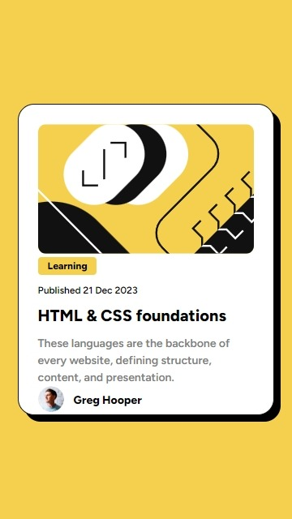
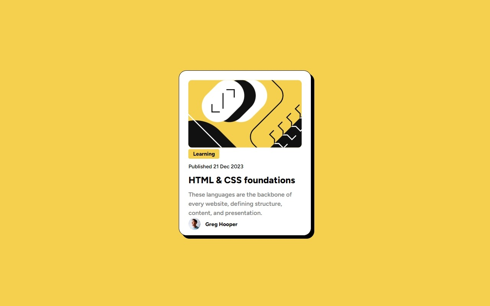

# Blog preview card

This is a solution to the [Blog preview card challenge on Frontend Mentor](https://www.frontendmentor.io/challenges/blog-preview-card-ckPaj01IcS). Frontend Mentor challenges help you improve your coding skills by building realistic projects. 

## Overview

### The challenge

Users should be able to:

- See hover and focus states for all interactive elements on the page ✔

### Screenshot

### Links

- Solution URL: [Add solution URL here](https://github.com/Smailen5/Frontend-Mentor-Challenge/tree/main/blog-preview-card-main-main)
- Live Site URL: [Add live site URL here](https://smailen5.github.io/Frontend-Mentor-Challenge/blog-preview-card-main-main/)

## My process

### Built with

- HTML5
- CSS
- Mobile-first workflow

## Author

- Website - [Smailen Vargas portfolio](https://smailenvargas.com/)
- Github - [Smailen5](https://github.com/Smailen5)
- Frontend Mentor - [@ Smailen5](https://www.frontendmentor.io/profile/Smailen5)
- Linkedin - [Smailen Vargas](https://www.linkedin.com/in/smailen-vargas/)
