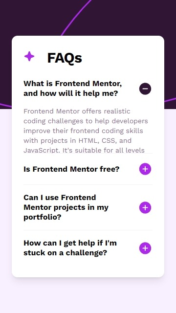
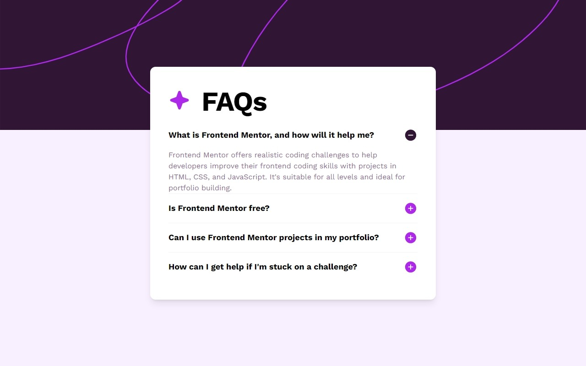

# FAQ accordion

This is a solution to the [FAQ accordion challenge on Frontend Mentor](https://www.frontendmentor.io/challenges/faq-accordion-wyfFdeBwBz). Frontend Mentor challenges help you improve your coding skills by building realistic projects.

## Overview

### The challenge

Users should be able to:

- Hide/Show the answer to a question when the question is clicked ✔
- Navigate the questions and hide/show answers using keyboard navigation alone ✔
- View the optimal layout for the interface depending on their device's screen size ✔
- See hover and focus states for all interactive elements on the page ✔

### Screenshot




### Links

- Solution URL: [Solution](https://github.com/Smailen5/Frontend-Mentor-Challenge/tree/main/faq-accordion)
- Live Site URL: [Live site](https://velvety-pixie-ac034e.netlify.app/)

## My process

### Built with

- HTML5
- Mobile-first workflow
- Svgr
- Tailwind
- Shadcn
- Typescript
- React

### What I learned

I practiced using the `svgr` library, Shadcn UI, and Atomic Design. I also learned the importance of adding ARIA attributes and how to set up elements to be keyboard accessible.

To see how you can add code snippets, see below:

I replaced the `header` tag with the `button` tag to improve accessibility and added the `aria` attribute:

```jsx
<button tabIndex={0} aria-expanded={isOpen}>
  <h2>...</h2>
</button>
```

### Continued development

...

### Useful resources

...

## Author

- Website - [Smailen Vargas portfolio](https://smailenvargas.com/)
- Github - [Smailen5](https://github.com/Smailen5)
- Frontend Mentor - [@ Smailen5](https://www.frontendmentor.io/profile/Smailen5)
- Linkedin - [Smailen Vargas](https://www.linkedin.com/in/smailen-vargas/)

### Acknowledgments

Thanks to [Eli Seta](https://www.frontendmentor.io/profile/elisilk) for the valuable feedback that helped me improve the project, particularly for:

- Having the FAQ open on page load.
- Correctly aligning the titles in the buttons.
- Ensuring the proper loading of the fonts.
