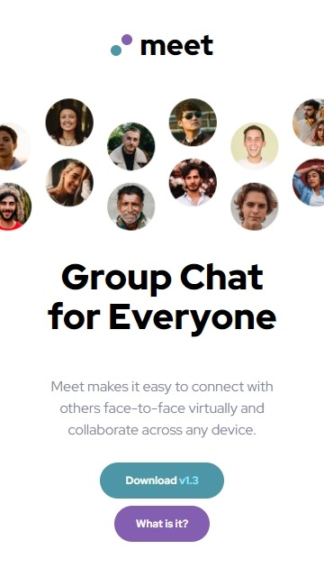
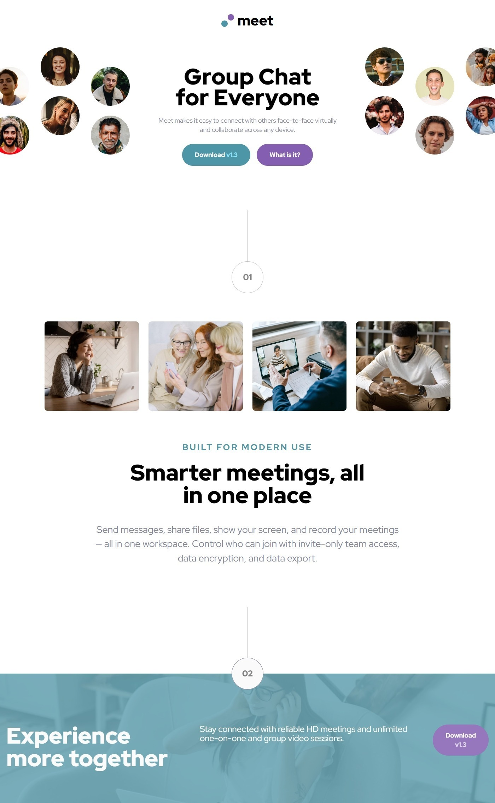

# Meet landing page

This is a solution to the [Meet landing page challenge on Frontend Mentor](https://www.frontendmentor.io/challenges/meet-landing-page-rbTDS6OUR). Frontend Mentor challenges help you improve your coding skills by building realistic projects. 


## Overview

### The challenge

Users should be able to:

- View the optimal layout depending on their device's screen size ✔
- See hover states for interactive elements ❌

### Screenshot





### Links

- Solution URL: [Solution](https://github.com/Smailen5/Frontend-Mentor-Challenge/tree/main/meet-landing-page-main)
- Live Site URL: [Live site](https://smailen5.github.io/Frontend-Mentor-Challenge/meet-landing-page-main/)

## My process

### Built with

- HTML5
- Mobile-first workflow
- Tailwind


### What I learned

I've learned to use base layers to define repetitive classes and keep the code cleaner.

```css
@layer base {
    .btn-default-1 {
      @apply bg-green text-white rounded-full p-3 px-7 text-xs font-bold;
    }
}
```


### Continued development

I spent a lot of time trying to figure out how to position the footer correctly in large desktop screen mode. Unfortunately, I couldn't figure out how to solve it. In the future, I'll work on this to get closer to the required layout.


### Useful resources

- [Tailwind](https://tailwindcss.com/docs/installation) - I used the Tailwind documentation while writing the styles.


## Author

- Website - [Smailen Vargas portfolio](https://smailenvargas.com/)
- Github - [Smailen5](https://github.com/Smailen5)
- Frontend Mentor - [@ Smailen5](https://www.frontendmentor.io/profile/Smailen5)
- Linkedin - [Smailen Vargas](https://www.linkedin.com/in/smailen-vargas/)


## Acknowledgments

...