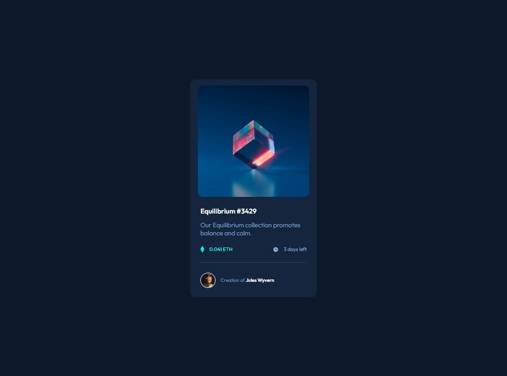

# NFT preview card component

This is a solution to the [NFT preview card component challenge on Frontend Mentor](https://www.frontendmentor.io/challenges/nft-preview-card-component-SbdUL_w0U). Frontend Mentor challenges help you improve your coding skills by building realistic projects. 

## Overview

### The challenge

Users should be able to:

- View the optimal layout depending on their device's screen size
- See hover states for interactive elements

### Screenshot

### Links

- Solution here: [Solution](https://github.com/Smailen5/Frontend-Mentor-Challenge/tree/main/nft-preview-card-component-main-main)
- Live Site URL: [Live site](https://smailen5.github.io/Frontend-Mentor-Challenge/nft-preview-card-component-main-main/)

## My process

### Built with

- HTML5
- CSS
- Javascript

### Continued development

- Centrare icon-view con margin 41% funziona ma, voglio trovare un modo più elegante di centrarlo.
- Non capisco perche la classe active viene aggiunta è rimossa di continuo anche se il mouse si trova all'interno dell'immagine, in futuro spero di risolvere
  potrebbe funzionare dando a img-active un colore totalmente trasparente anziche display none e al passaggio del mouse cambio il colore, potrebbero esserci
  problemi con icon-view.
- Il problema con img-active non susiste è dovuto alla tab Dev Tolls attiva, quindi il codice funziona

## Author

- Frontend Mentor - [@Smaylen5](https://www.frontendmentor.io/profile/Smailen5)
- Linkedin - [@Smailen_Vargas](https://www.linkedin.com/in/smailen-vargas/)

