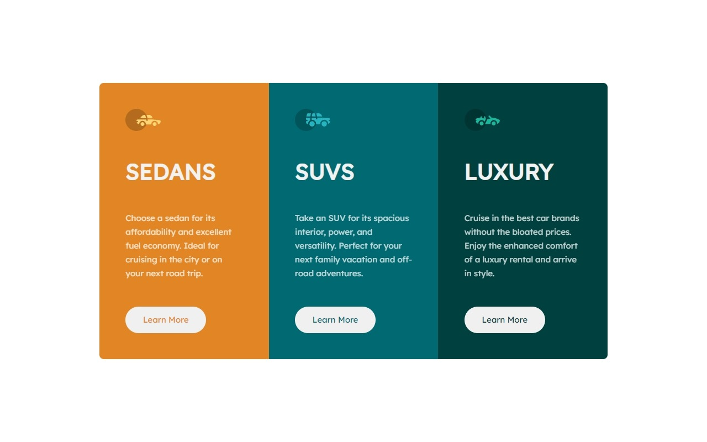
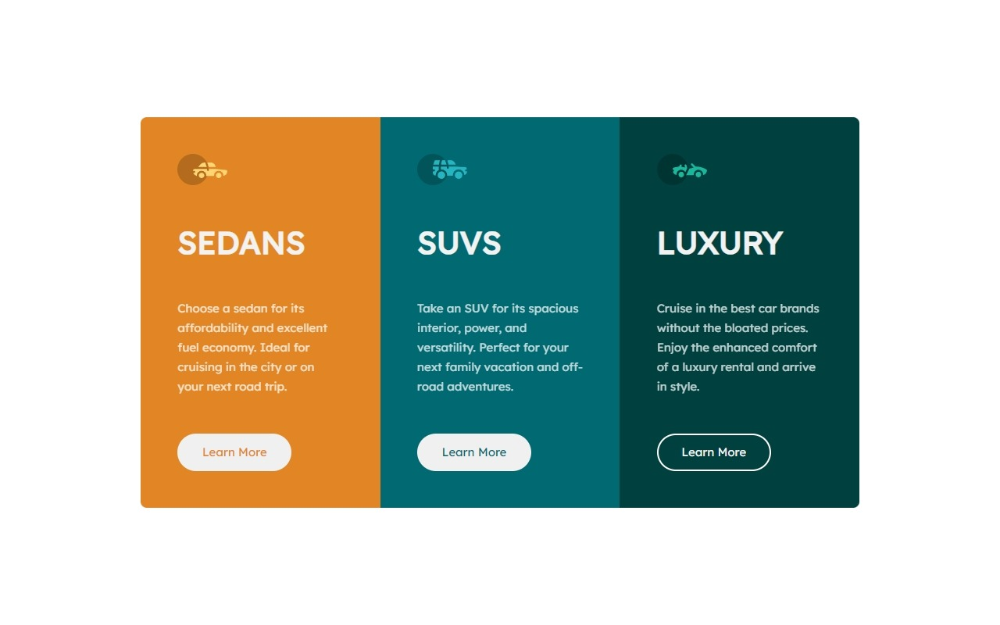

# 3 Column preview card component

This is a solution to the [3-column preview card component challenge on Frontend Mentor](https://www.frontendmentor.io/challenges/3column-preview-card-component-pH92eAR2-). Frontend Mentor challenges help you improve your coding skills by building realistic projects.

## Overview

### The challenge

Users should be able to:

- View the optimal layout depending on their device's screen size ✔
- See hover states for interactive elements ✔

### Screenshot





### Links

- Solution URL: [Soluzione](https://github.com/Smailen5/Frontend-Mentor-Challenge/tree/main/packages/3-column-preview-card-component-main-main)
- Live Site URL: [Sito](https://smailen5.github.io/Frontend-Mentor-Challenge/3-column-preview-card-component-main-main/)

## My process

### Built with

- HTML5
- CSS

### What I learned

Ho utilizzato per la prima volta la regola !important, in quanto il selettore usato in precedenza era molto più specifico

```css
.button:hover {
  color: #f2f2f2 !important;
}
```

### Continued development

In futuro vorrei aggiungere degli effiti di slide con JavaScript e magari animare le icone svg

## Author

- Website - [Smailen Vargas portfolio](https://smailenvargas.com/)
- Github - [Smailen5](https://github.com/Smailen5)
- Frontend Mentor - [@ Smailen5](https://www.frontendmentor.io/profile/Smailen5)
- Linkedin - [Smailen Vargas](https://www.linkedin.com/in/smailen-vargas/)
