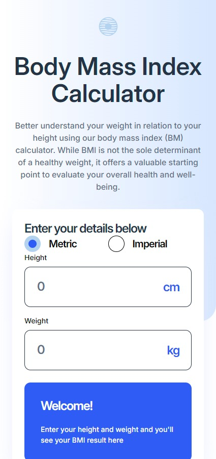
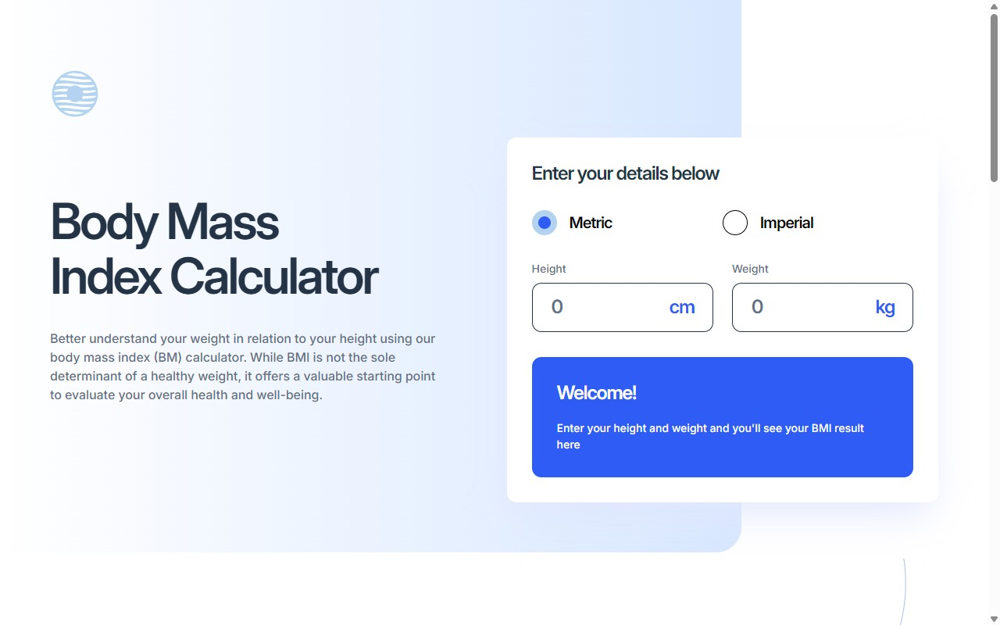

# Frontend Mentor - Body Mass Index Calculator solution

This is a solution to the [Body Mass Index Calculator challenge on Frontend Mentor](https://www.frontendmentor.io/challenges/body-mass-index-calculator-brrBkfSz1T). Frontend Mentor challenges help you improve your coding skills by building realistic projects.

## Overview

### The challenge

Users should be able to:

- [✔️] Select whether they want to use metric or imperial units
- [✔️] Enter their height and weight
- [✔️] See their BMI result, with their weight classification and healthy weight range
- [✔️] View the optimal layout for the interface depending on their device's screen size
- [✔️] See hover and focus states for all interactive elements on the page

### Screenshot




### Links

- Solution URL: [Add solution URL here](https://github.com/Smailen5/Frontend-Mentor-Challenge/tree/main/packages/bmi-calculator)
- Live Site URL: [Add live site URL here](https://melodic-bublanina-b5bb80.netlify.app/)

## My process

### Built with

- CSS
- Flexbox
- Mobile-first workflow
- TypeScript
- Tailwind
- React

### What I learned

- Add a dinamic margin to the cards with the row number `${row.rowNumber % 2 === 0 ? 0 : row.rowNumber * 4}rem`

```tsx
<div className="top-0 right-0 hidden xl:absolute xl:flex xl:flex-col xl:space-y-8">
  {chunkCards(cards).map((row, index) => (
    <div
      key={index}
      className="flex flex-1 justify-end gap-8"
      style={{
        marginRight: `${row.rowNumber % 2 === 0 ? 0 : row.rowNumber * 4}rem`,
      }}
    >
      {row.cards.map((card, index) => (
        <LimitationCard
          key={index}
          title={card.title}
          description={card.description}
          icon={card.icon}
        />
      ))}
    </div>
  ))}
</div>
```

- Divide the cards in rows with `chunkCards`

```ts
function chunkCards(cards: CardProps[]): { cards: CardProps[]; rowNumber: number }[] {
  const rows: { cards: CardProps[]; rowNumber: number }[] = [];
  let index = 0;
  let rowNumber = 1;
  for (let rowSize = 1; index < cards.length; rowSize++) {
    rows.push({
      cards: cards.slice(index, index + rowSize),
      rowNumber: rowNumber,
    });
    index += rowSize;
    rowNumber++;
  }
  return rows;
}
```

### Continued development

...

### Useful resources

- [Devine formula](https://www.omnicalculator.com/it/salute/peso-ideale) - This helped me to understand the formula to calculate the ideal weight

## Author

- Website - [Smailen Vargas portfolio](https://smailenvargas.com/)
- Github - [Smailen5](https://github.com/Smailen5)
- Frontend Mentor - [@ Smailen5](https://www.frontendmentor.io/profile/Smailen5)
- Linkedin - [Smailen Vargas](https://www.linkedin.com/in/smailen-vargas/)

## Acknowledgments

...
