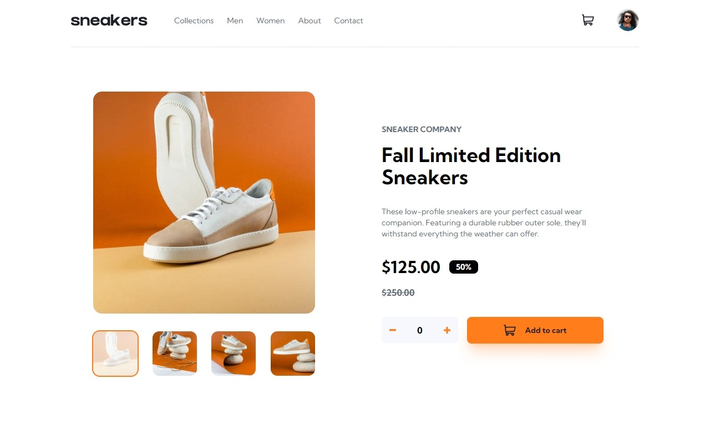
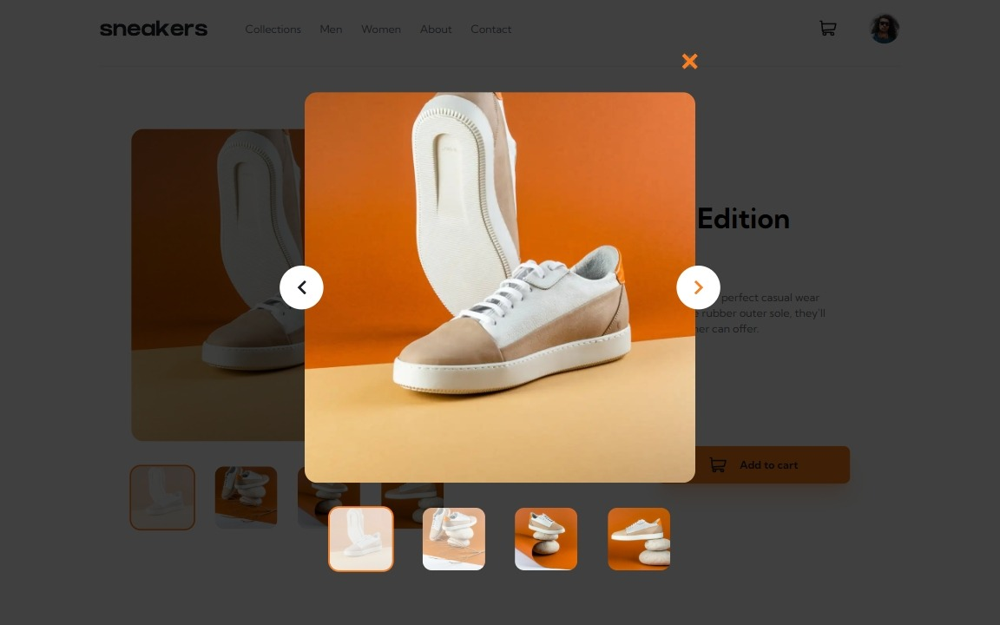
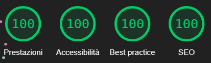

# Frontend Mentor - E-commerce product page solution

This is a solution to the [E-commerce product page challenge on Frontend Mentor](https://www.frontendmentor.io/challenges/ecommerce-product-page-UPsZ9MJp6). Frontend Mentor challenges help you improve your coding skills by building realistic projects.

## Overview

### The challenge

Users should be able to:

- ✔ View the optimal layout for the site depending on their device's screen size
- ✔ See hover states for all interactive elements on the page
- ✔ Open a lightbox gallery by clicking on the large product image
- ✔ Switch the large product image by clicking on the small thumbnail images
- ✔ Add items to the cart
- ✔ View the cart and remove items from it

### Screenshot

<details>
<summary> 📱 View Smartphone</summary>


</details>

<details>
<summary> 💻 View Desktop</summary>



</details>

<details>
<summary>🚀 View Desktop Hover</summary>



</details>

<details>
<summary>🚀 View Lighthouse Performance</summary>



</details>

### Links

- Solution URL: [Solution](https://github.com/Smailen5/Frontend-Mentor-Challenge/tree/main/packages/ecommerce-product-page)
- Live Site URL: [Live site](https://funny-swan-69bb4e.netlify.app/)

## My process

### Built with

- HTML5
- Tailwind v4.0.6
- Mobile-first workflow
- TypeScript
- SVGR
- React
- React Router
- Framer Motion
- Vite
- JSDoc

### What I learned

I learned to create a responsive website using HTML, Tailwind and React, organizing the code into components following the atomic design convention. I learned to separate component logic with custom hooks and TypeScript types. I learned to optimize the application using code splitting and lazy loading, and I also divided the bundle into chunks to improve performance. I learned to use AI (Claude 3.5 Sonnet) to generate project documentation. I learned to use `Tailwind CSS v4.0.6`, first migrating the project from `v3.5.0` with Tailwind's migration tool.

I really like the new Tailwind structure, now I don't have to keep switching between the `index.css` file and `tailwind.config.ts` to modify Tailwind variables:

```css
@import url("https://fonts.googleapis.com/css2?family=Kumbh+Sans:wght@400;700&display=swap");
@import "tailwindcss";

@theme {
  --font-kumbh: "Kumbh Sans", sans-serif;

  --color-background: var(--white);
  --color-foreground: var(--very-dark-blue);

  --color-primary: var(--orange);
  --color-primary-foreground: var(--very-dark-blue);
}

@layer base {
  :root {
    --orange: hsl(26, 100%, 55%);
    --very-dark-blue: hsl(220, 13%, 13%);
    --white: hsl(0, 0%, 100%);
  }
}
```

I learned to use SVGs as React components and change the color with the `[&>path]:fill-current` class:

```tsx
<IconCart aria-hidden={true} className="[&>path]:fill-current" />
```

I started using Framer Motion for animations:

```jsx
const slideVariants = {
  enter: (direction: number) => ({
    x: direction > 0 ? 1000 : -1000,
    opacity: 0,
  }),
  center: {
    zIndex: 1,
    x: 0,
    opacity: 1,
  },
  exit: (direction: number) => ({
    zIndex: 0,
    x: direction < 0 ? 1000 : -1000,
    opacity: 0,
  }),
};

<AnimatePresence initial={false} custom={direction}>
  <motion.img
    key={currentImage}
    src={imageProducts[currentImage]}
    custom={direction}
    variants={slideVariants}
    initial="enter"
    animate="center"
    exit="exit"
    transition={{
      x: { type: "spring", stiffness: 300, damping: 30 },
      opacity: { duration: 0.2 },
    }}
  />
</AnimatePresence>
```

### Continued development

I really like React Router, but I've watched some videos about TanStack Router and it seems very powerful and more convenient to use, so I plan to explore it in the future.

I've gained some understanding of how Framer Motion works, and besides diving deeper into it, I'm also looking for a new animation library.

It was interesting to see how AI generated comments and documentation for the project. I've decided that in the future, I'll let AI write the documentation, limiting myself to reviewing the comments before committing.

### Useful resources

...

## Author

- Website - [Smailen Vargas portfolio](https://smailenvargas.com/)
- Github - [Smailen5](https://github.com/Smailen5)
- Frontend Mentor - [@ Smailen5](https://www.frontendmentor.io/profile/Smailen5)
- Linkedin - [Smailen Vargas](https://www.linkedin.com/in/smailen-vargas/)

## Acknowledgments

...
