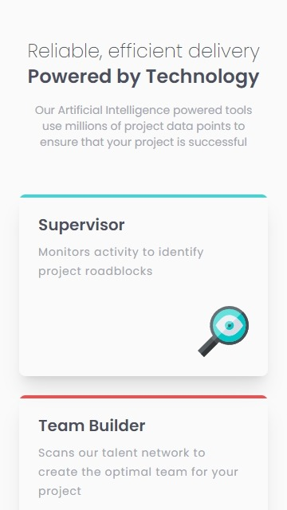
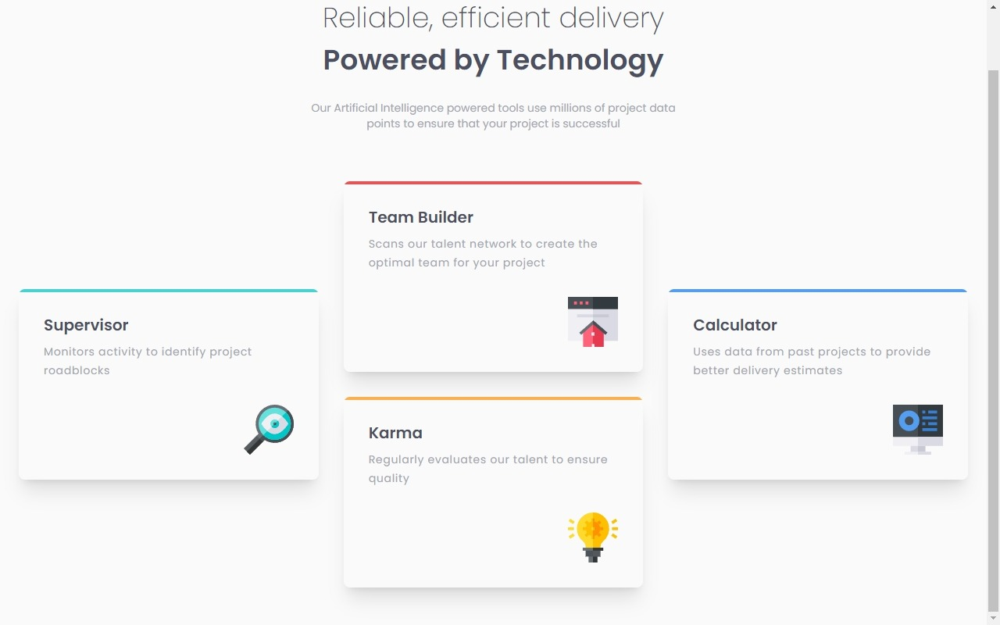

# Four card feature section

This is a solution to the [Four card feature section challenge on Frontend Mentor](https://www.frontendmentor.io/challenges/four-card-feature-section-weK1eFYK). Frontend Mentor challenges help you improve your coding skills by building realistic projects.


## Overview

### The challenge

Users should be able to:

- View the optimal layout for the site depending on their device's screen size ✔

### Screenshot




### Links

- Solution URL: [Solution](https://github.com/Smailen5/Frontend-Mentor-Challenge/tree/main/packages/four-card-feature-section-master-main)
- Live Site URL: [Site](https://smailen5.github.io/Frontend-Mentor-Challenge/four-card-feature-section-master-main/)

## My process

### Built with

- HTML5
- Mobile-first workflow
- Tailwind


### What I learned

The most challenging part I had to deal with was grid alignment in the desktop layout. It's one of the first times I've used grid, and it's really fantastic.
```html
<div class="md:row-start-2 md:row-end-4 md:max-w-sm"></div>
```

Unfortunately, I couldn't import the fonts as I wanted using `@import` in the CSS file, so I opted to import them in the `index.html` file using the `<style>` tag.
```css
@import url("https://fonts.googleapis.com/css2?family=Poppins:wght@200;400;600&display=swap");
```


### Useful resources

- [Documentazione Tailwind](https://tailwindcss.com/docs/max-width) - The resource I used the most was the Tailwind documentation.


## Author

- Website - [Smailen Vargas portfolio](https://smailenvargas.com/)
- Github - [Smailen5](https://github.com/Smailen5)
- Frontend Mentor - [@ Smailen5](https://www.frontendmentor.io/profile/Smailen5)
- Linkedin - [Smailen Vargas](https://www.linkedin.com/in/smailen-vargas/)
