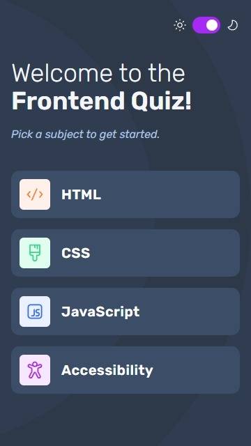

# Frontend quiz app

This is a solution to the [Frontend quiz app challenge on Frontend Mentor](https://www.frontendmentor.io/challenges/frontend-quiz-app-BE7xkzXQnU). Frontend Mentor challenges help you improve your coding skills by building realistic projects.

## Overview

### The challenge

Users should be able to:

- Select a quiz subject ✔
- Select a single answer from each question from a choice of four ✔
- See an error message when trying to submit an answer without making a selection ✔
- See if they have made a correct or incorrect choice when they submit an answer ✔
- Move on to the next question after seeing the question result ✔
- See a completed state with the score after the final question ✔
- Play again to choose another subject ✔
- View the optimal layout for the interface depending on their device's screen size ✔
- See hover and focus states for all interactive elements on the page ✔
- Navigate the entire app only using their keyboard ✔
- **Bonus**: Change the app's theme between light and dark ✔

### Screenshot

### Links

- Solution URL: [Solution](https://github.com/Smailen5/Frontend-Mentor-Challenge/tree/main/packages/frontend-quiz-app)
- Live Site URL: [Live site](https://bejewelled-creponne-01b996.netlify.app/)

## My process

### Built with

- HTML5
- Mobile-first workflow
- Tailwind
- Tailwind Merge
- TypeScript
- Svgr
- React
- React router dom 6

### What I learned

- **Atomic Design**: I became familiar with Atomic Design, organizing the code into hierarchical components (atoms, molecules, organisms), improving code readability and reusability.

- **Practice with TypeScript**: I deepened my understanding of TypeScript, learning to manage types and interfaces, which made my code more robust and less prone to errors.

- **Use of SVGR**: I learned to use SVGR to handle `SVG` icons as React components, simplifying icon management and improving the performance of my application.

- **Dark Mode with Tailwind**: I implemented dark mode using Tailwind CSS, retrieving the preference from the device and saving it in `localStorage` to ensure a consistent user experience.

### Continued development

I want to try adding localization in Italian for the quizzes.

### Useful resources

- [progress bar react](https://react.dev/reference/react-dom/components/progress) - This resource was very helpful for understanding how to set up my ProgressBar. I didn't use this progress bar because when I use Tailwind, I prefer not to write CSS in the global stylesheet.
- [svgr npm](https://www.npmjs.com/package/vite-plugin-svgr) - Very useful for using SVG icons as React components.
- [svgr resource 1](https://medium.com/@praizjosh/how-to-import-svg-files-as-react-components-in-vite-97d6e1f2c046)
- [svgr resource 2](https://stackoverflow.com/questions/77280652/vite-plugin-svgr-does-not-working-in-vite-react-and-TypeScript)

## Author

- Website - [Smailen Vargas portfolio](https://smailenvargas.com/)
- Github - [Smailen5](https://github.com/Smailen5)
- Frontend Mentor - [@ Smailen5](https://www.frontendmentor.io/profile/Smailen5)
- Linkedin - [Smailen Vargas](https://www.linkedin.com/in/smailen-vargas/)

## Acknowledgments
