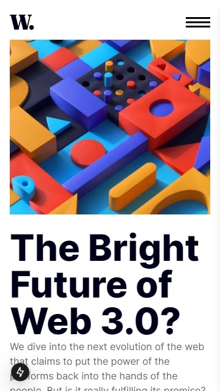
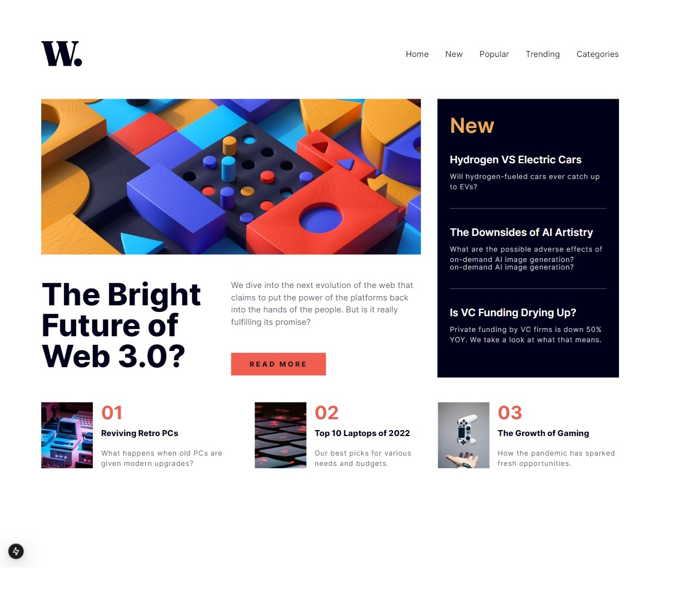

# Frontend Mentor - News homepage solution

This is a solution to the [News homepage challenge on Frontend Mentor](https://www.frontendmentor.io/challenges/news-homepage-H6SWTa1MFl). Frontend Mentor challenges help you improve your coding skills by building realistic projects.

## Overview

### The challenge

Users should be able to:

- View the optimal layout for the interface depending on their device's screen size
- See hover and focus states for all interactive elements on the page

### Screenshot

### Links

- Solution URL: [Solution](https://github.com/Smailen5/Frontend-Mentor-Challenge/tree/main/news-homepage)
- Live Site URL: [Live site](https://news-homepage-beta-eight.vercel.app/)

## My process

### Built with

- HTML5
- CSS
- Flexbox
- CSS Grid
- Mobile-first workflow
- Next.js
- Tailwind
- TypeScript
- pnpm
- standard-version

### What I learned

...

### Continued development

...

### Useful resources

...

## Author

- Website - [Smailen Vargas portfolio](https://smailenvargas.com/)
- Github - [Smailen5](https://github.com/Smailen5)
- Frontend Mentor - [@ Smailen5](https://www.frontendmentor.io/profile/Smailen5)
- Linkedin - [Smailen Vargas](https://www.linkedin.com/in/smailen-vargas/)

## Acknowledgments

...
