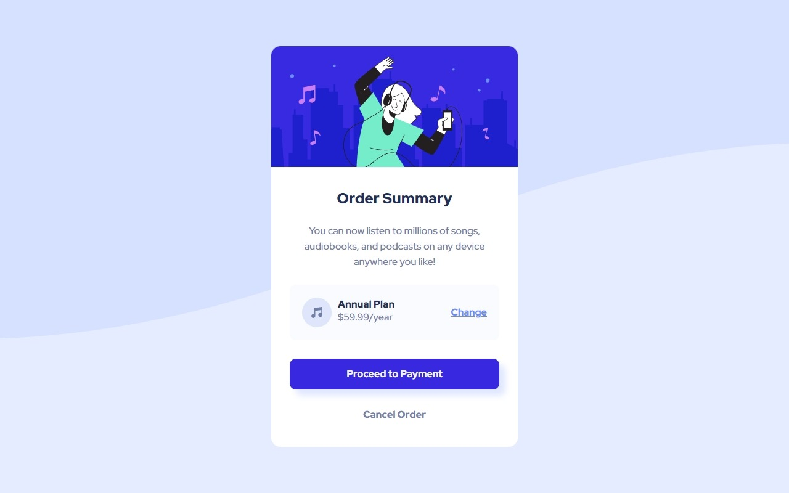

# Order summary card

This is a solution to the [Order summary card challenge on Frontend Mentor](https://www.frontendmentor.io/challenges/order-summary-component-QlPmajDUj). Frontend Mentor challenges help you improve your coding skills by building realistic projects.


## Overview

### The challenge

Users should be able to:

- See hover states for interactive elements ✔

### Screenshot




### Links

- Solution URL: [Solution URL here](https://github.com/Smailen5/Frontend-Mentor-Challenge/tree/main/packages/order-summary-component-main-main)
- Live Site URL: [live site](https://smailen5.github.io/Frontend-Mentor-Challenge/order-summary-component-main-main/)

## My process

### Built with

- HTML5
- CSS


### What I learned

In questo progetto ho imparato a cambiare i valori dei colori hsl: colore e traparenza. Ho imparato a selezionare meglio gli elementi con :nth-child()

Ecco alcuni esempi di codice che ho usato:

```css
body {
  background-color: hsl(225, 100%, 95%);
}

.date span:nth-child(1) {
    color: hsl(223, 47%, 23%);
    font-weight: 900;
}
```


### Useful resources

Tutto il codice l'ho scritto da solo con l'ausilio di ChatGpt per il css. Usato esclusivamente per impostare la media query

## Author

- Website - [Smailen Vargas portfolio](https://smailenvargas.com/)
- Github - [Smailen5](https://github.com/Smailen5)
- Frontend Mentor - [@ Smailen5](https://www.frontendmentor.io/profile/Smailen5)
- Linkedin - [Smailen Vargas](https://www.linkedin.com/in/smailen-vargas/)
