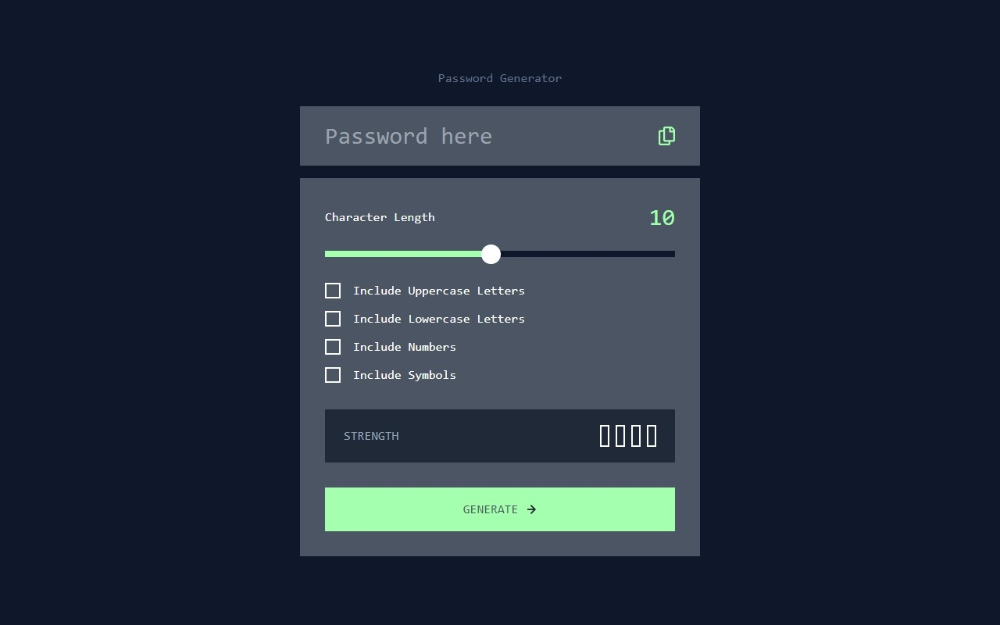

# Password generator app

This is a solution to the [Password generator app challenge on Frontend Mentor](https://www.frontendmentor.io/challenges/password-generator-app-Mr8CLycqjh). Frontend Mentor challenges help you improve your coding skills by building realistic projects.

## Overview

### The challenge

Users should be able to:

- Generate a password based on the selected inclusion options ✔
- Copy the generated password to the computer's clipboard ✔
- See a strength rating for their generated password ✔
- View the optimal layout for the interface depending on their device's screen size ❌
- See hover and focus states for all interactive elements on the page ❌

### Screenshot




### Links

- Solution URL: [Solution](https://github.com/Smailen5/Frontend-Mentor-Challenge/tree/main/password-generator-app)
- Live Site URL: [Live site](https://smailen5.github.io/Frontend-Mentor-Challenge/password-generator-app/)

## My process

### Built with

- HTML5
- Mobile-first workflow
- Tailwind
- JavaScript

### What I learned

- At first, I wanted to display the password in a paragraph, but then I realized that I would lose some methods that I needed in JavaScript. So, I changed it to a text input instead.

```html
<!-- Before -->
<p id="password" class="text-3xl"></p>
<!-- After -->
<input
  type="text"
  name="password"
  id="password"
  class="bg-gray-600 text-3xl text-white"
  placeholder="Password here"
/>
```

- I wanted to add a promise to check if I copied the password correctly or not.

```js
navigator.clipboard
  .writeText(password.value)
  .then(() => {
    // Alert che il testo è stato copiato con successo
    alert("Copied the text: " + password.value);
  })
  .catch((error) => {
    // Gestione degli errori
    console.error("Unable to copy text: ", error);
    alert("Unable to copy text: " + error);
  });
```

### Continued development

The next time I work on this code, I'd like to do a thorough refactoring of the entire script. I'm sure there's room for improvement.

### Useful resources

- [Resource 1](https://codepen.io/chakachuk/pen/jOdVXEp?editors=1010) - I used this code, which I revised and adjusted for my use.

- [Resource 2](https://dev.to/rashidshamloo/styling-input-range-sliders-nge) - This was very helpful in understanding shadow DOM and being able to change the color of the thumb.

- [Resource 3](https://marek-rozmus.medium.com/styling-checkbox-with-tailwind-46a92c157e2d) - That was helpful in understanding how to use peer.

- [Resource 4](https://developer.mozilla.org/en-US/docs/Web/JavaScript/Reference/Global_Objects/Array) - Used for array methods for a slip.

- [Resource 5](https://stackoverflow.com/questions/1497481/JavaScript-password-generator) -
  Useful for understanding how to generate a password from a specific charset, adapted to my purpose.

- [Resource 6](https://developer.mozilla.org/en-US/docs/Web/API/Element/classList) -
  I found it very convenient to add and remove classes stored in an array as described by MDN.

## Author

- Website - [Smailen Vargas portfolio](https://smailenvargas.com/)
- Github - [Smailen5](https://github.com/Smailen5)
- Frontend Mentor - [@ Smailen5](https://www.frontendmentor.io/profile/Smailen5)
- Linkedin - [Smailen Vargas](https://www.linkedin.com/in/smailen-vargas/)

## Acknowledgments

...
