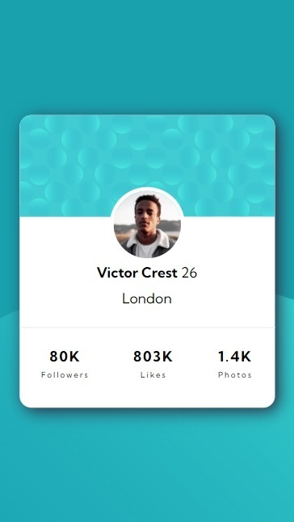
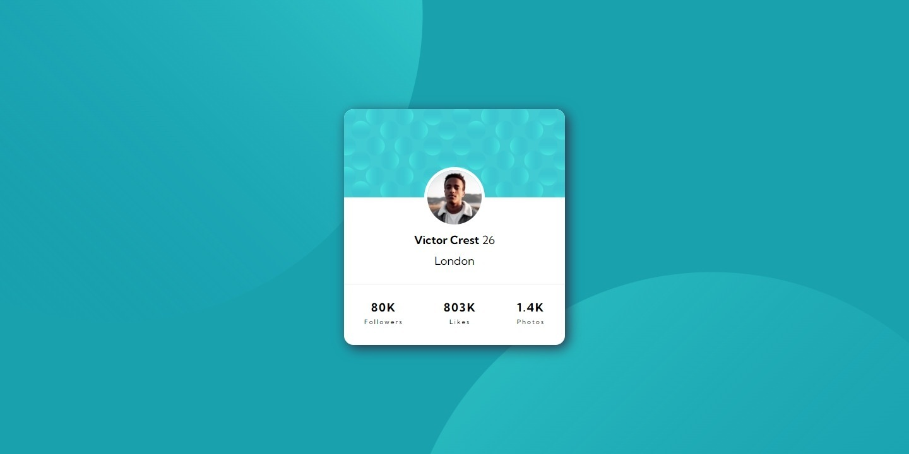

# Profile card component

This is a solution to the [Profile card component challenge on Frontend Mentor](https://www.frontendmentor.io/challenges/profile-card-component-cfArpWshJ). Frontend Mentor challenges help you improve your coding skills by building realistic projects.


## Overview

### The challenge

- View the optimal layout depending on their device's screen size


### Screenshot





### Links

- Solution URL: [Solution URL here](https://github.com/Smailen5/Frontend-Mentor-Challenge/tree/main/packages/profile-card-component-main-main)
- Live Site URL: [Live site URL here](https://smailen5.github.io/Frontend-Mentor-Challenge/profile-card-component-main-main/)

## My process

### Built with

- HTML5
- CSS


### What I learned

Progetto impegnativo, per centrare il nome e tutto il contenuto ho preferito usare flex-box e l'imitare l'uso di margine. Ho completato il componente guradando il progetto su figma per la prima volta.

Prima volta che setto l'attributo alt

```html

```

Ho imparato a usare overflow hidden per nascondere l'eccedenza della sfera o avrebbe aggiunto la barra di navigazione per lo scorrimento.

```css
body {
    overflow: hidden;
}
```


## Author

- Website - [Smailen Vargas portfolio](https://smailenvargas.com/)
- Github - [Smailen5](https://github.com/Smailen5)
- Frontend Mentor - [@ Smailen5](https://www.frontendmentor.io/profile/Smailen5)
- Linkedin - [Smailen Vargas](https://www.linkedin.com/in/smailen-vargas/)
