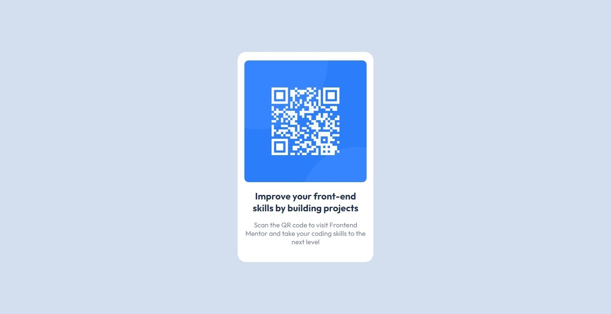

# QR code component

## Welcome! 👋

Thanks for checking out this front-end coding challenge.
This is my first challenge on [Frontend Mentor](https://www.frontendmentor.io/home)

### Screenshot

- versione 1.1

- versione 1.0

### Links

- URL Soluzione: [Soluzione](https://github.com/Smailen5/Frontend-Mentor-Challenge/tree/main/packages/qr-code-component-main-main)
- URL Sito: [Sito](https://smailen5.github.io/Frontend-Mentor-Challenge/qr-code-component-main-main/)

### Built with

- HTML5
- CSS

## Author

- Website - [Smailen Vargas portfolio](https://smailenvargas.com/)
- Github - [Smailen5](https://github.com/Smailen5)
- Frontend Mentor - [@ Smailen5](https://www.frontendmentor.io/profile/Smailen5)
- Linkedin - [Smailen Vargas](https://www.linkedin.com/in/smailen-vargas/)
