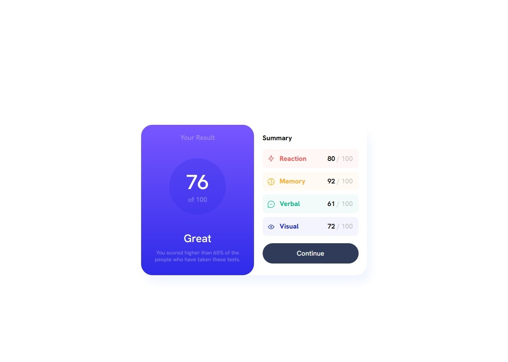

# Result summary component

### The challenge

- The challenge was starting from the mobile version and then adapting it to the desktop ✔
- See hover state for button element on the page ✔

### Screenshot

### Links

- Solution here: [Solution](https://github.com/Smailen5/Frontend-Mentor-Challenge/tree/main/packages/results-summary-component-main-main)
- Live Site URL: [Live site URL here](https://smailen5.github.io/Frontend-Mentor-Challenge/results-summary-component-main-main/)

### My process

### Built with

- HTML5
- CSS
- Mobile-first workflow

### What I learned

In this exercise I improved my understanding of Media Queries. I used the pseudo class :hover also adding cursor pointer and removing the possibility that the user can select the text of the button by mistake.

### Continued development

I want to focus more on Media Queries, I understand the basics but, I want to create better responsive layouts. I think I need to study Bootstrap to improve CSS code reading, the class names I use are not always comprehensive at first glance.

## Author

- Website - [Smailen Vargas portfolio](https://smailenvargas.com/)
- Github - [Smailen5](https://github.com/Smailen5)
- Frontend Mentor - [@ Smailen5](https://www.frontendmentor.io/profile/Smailen5)
- Linkedin - [Smailen Vargas](https://www.linkedin.com/in/smailen-vargas/)

## Acknowledgments

Thanks to [@Bader-Idris](https://www.frontendmentor.io/profile/Bader-Idris) for the advice, on the previous challenge, to use
   .container {
  position: absolute;
  top:50%;
  left: 50%;
  transform: translate(-50%, -50%);
}
to center the containers
