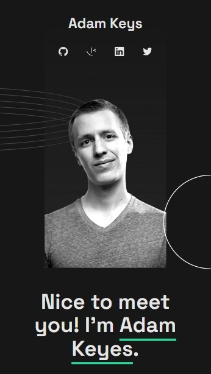
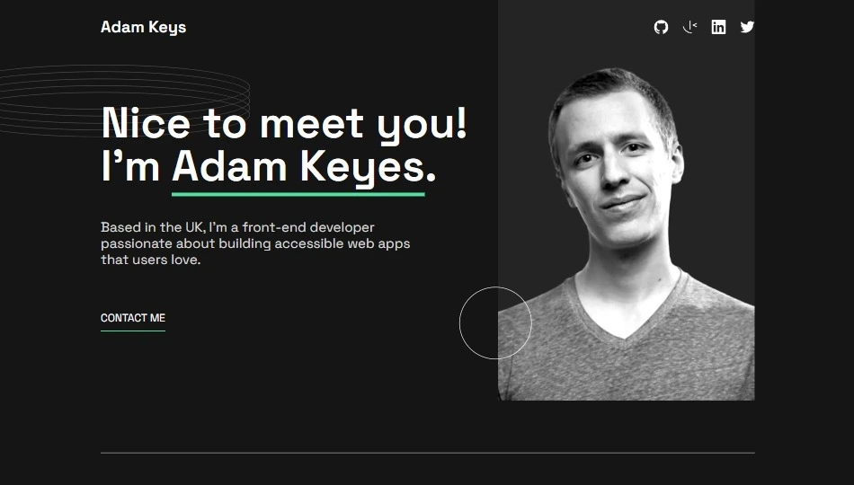

# Portfolio single page

## Overview

### Screenshot

<!-- converti questa immagine in jpeg -->
<!--  -->

### Links

- Solution URL: [Add solution URL here](https://github.com/Smailen5/Frontend-Mentor-Challenge/tree/main/packages/single-page-developer-portfolio)
- Live Site URL: [Add live site URL here](https://66acfedd0175d378b05368b4--fanciful-tulumba-14b591.netlify.app/)

## My process

### Built with

- HTML5
- Mobile-first workflow
- Tailwind
- React
- React icons
- Formik
- Yup

### What I learned

- Managed forms with Formik and validation with Yup, enhancing form handling and user input validation in React applications.

### Useful resources

- [Formik Documentation](https://formik.org/docs/tutorial) - Comprehensive guide to Formik, a powerful form library for React.
- [Yup Documentation](https://formik.org/docs/guides/validation) - Useful resource for learning how to integrate Yup for form validation.

## Author

- Website - [Smailen Vargas portfolio](https://smailenvargas.com/)
- Github - [Smailen5](https://github.com/Smailen5)
- Frontend Mentor - [@ Smailen5](https://www.frontendmentor.io/profile/Smailen5)
- Linkedin - [Smailen Vargas](https://www.linkedin.com/in/smailen-vargas/)
