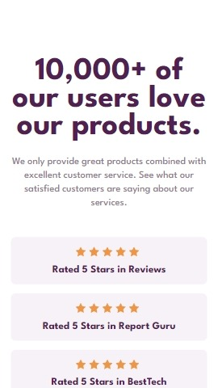
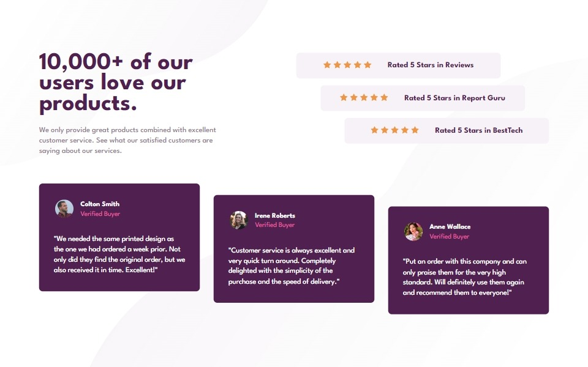

# Social proof section

This is a solution to the [Social proof section challenge on Frontend Mentor](https://www.frontendmentor.io/challenges/social-proof-section-6e0qTv_bA). Frontend Mentor challenges help you improve your coding skills by building realistic projects. 


## Overview

### The challenge

Users should be able to:

- View the optimal layout for the section depending on their device's screen size ✔

### Screenshot




### Links

- Soluzione URL: [Soluzione QUI](https://github.com/Smailen5/Frontend-Mentor-Challenge/tree/main/social-proof-section-master-main)
- Sito Live URL: [Sito live QUI](https://smailen5.github.io/Frontend-Mentor-Challenge/social-proof-section-master-main/)

## My process

### Built with

- HTML5
- CSS


### What I learned

Di solito usavo:

```css
.container-review span:nth-child()
```
In questo esercizio ho usato per la prima volta:

```css
.container-review span:first-child
```

## Continued development 

- Rendere responsive il layout non utilizzando più misure fisse
- Aggiungere una media query per tablet
- Aggiungere media query landscape per smartphone

## Author

- Website - [Smailen Vargas portfolio](https://smailenvargas.com/)
- Github - [Smailen5](https://github.com/Smailen5)
- Frontend Mentor - [@ Smailen5](https://www.frontendmentor.io/profile/Smailen5)
- Linkedin - [Smailen Vargas](https://www.linkedin.com/in/smailen-vargas/)