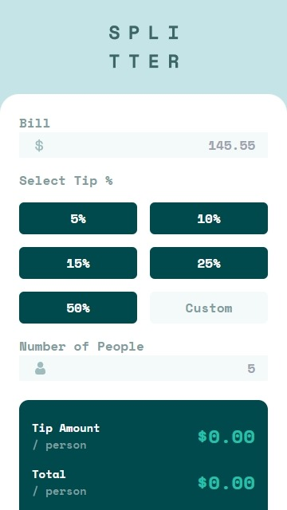

# Tip calculator app

This is a solution to the [Tip calculator app challenge on Frontend Mentor](https://www.frontendmentor.io/challenges/tip-calculator-app-ugJNGbJUX). Frontend Mentor challenges help you improve your coding skills by building realistic projects.

## Overview

### The challenge

Users should be able to:

- View the optimal layout for the app depending on their device's screen size ✔
- See hover states for all interactive elements on the page ❌
- Calculate the correct tip and total cost of the bill per person ✔

### Screenshot




### Links

- Solution URL: [Solution](https://github.com/Smailen5/Frontend-Mentor-Challenge/tree/main/packages/tip-calculator-app-main)
- Live Site URL: [Live site](https://smailen5.github.io/Frontend-Mentor-Challenge/tip-calculator-app-main/)

## My process

### Built with

- HTML5
- Mobile-first workflow
- Tailwind
- JavaScript

### What I learned

With `min="1"`, I saved myself 5 lines of code to verify that the entered value was greater than 0 XD GGGGGGGG source w3school

```html
<input min="1" />
```

Converting strings into numbers was easy; I remembered that there's already a function for this:

```js
tipInput.addEventListener("input", function (event) {
  const tipNumber = Number(event.target.value);
});
```

`Number()` instead of `toNumber()`, as I initially thought.

### Continued development

I want to add the custom button in the future. For now, I've only created it, but I haven't figured out how to make it work as requested.

### Useful resources

- [w3school](https://www.w3schools.com/tags/att_input_min.asp) - w3school resource for input attribute

## Author

- Website - [Smailen Vargas portfolio](https://smailenvargas.com/)
- Github - [Smailen5](https://github.com/Smailen5)
- Frontend Mentor - [@ Smailen5](https://www.frontendmentor.io/profile/Smailen5)
- Linkedin - [Smailen Vargas](https://www.linkedin.com/in/smailen-vargas/)
