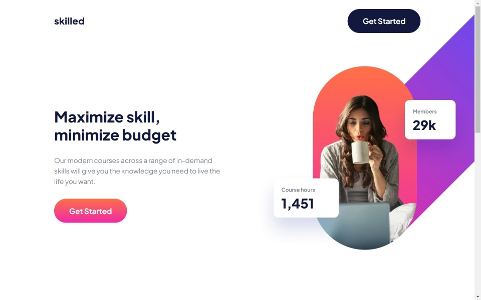

# Skilled e-learning landing page

This is a solution to the [Skilled e-learning landing page challenge on Frontend Mentor](https://www.frontendmentor.io/challenges/skilled-elearning-landing-page-S1ObDrZ8q). Frontend Mentor challenges help you improve your coding skills by building realistic projects.

## Overview

### The challenge

Users should be able to:

- View the optimal layout depending on their device's screen size
- See hover states for interactive elements ✔

### Screenshot

### Links

- Solution URL: [Solution URL here](https://github.com/Smailen5/Frontend-Mentor-Challenge/tree/main/skilled-elearning-landing-page)
- Live Site URL: [Live site URL here](https://soft-shortbread-7ebd18.netlify.app/)

## My process

### Built with

- HTML5
- Mobile-first workflow
- Tailwind
- Shadcn
- TypeScript

### What I learned

This exercise has been very useful for learning how to customize Shadcn UI components and practicing with TypeScript.

### Continued development

I notice that I have some issues with the UI when using `absolute` for very large components. In the future, I would like to focus on this and understand what I'm doing wrong.

### Useful resources

- [Shadcn ui](https://ui.shadcn.com/) - Documentation.

## Author

- Website - [Smailen Vargas portfolio](https://smailenvargas.com/)
- Github - [Smailen5](https://github.com/Smailen5)
- Frontend Mentor - [@ Smailen5](https://www.frontendmentor.io/profile/Smailen5)
- Linkedin - [Smailen Vargas](https://www.linkedin.com/in/smailen-vargas/)
