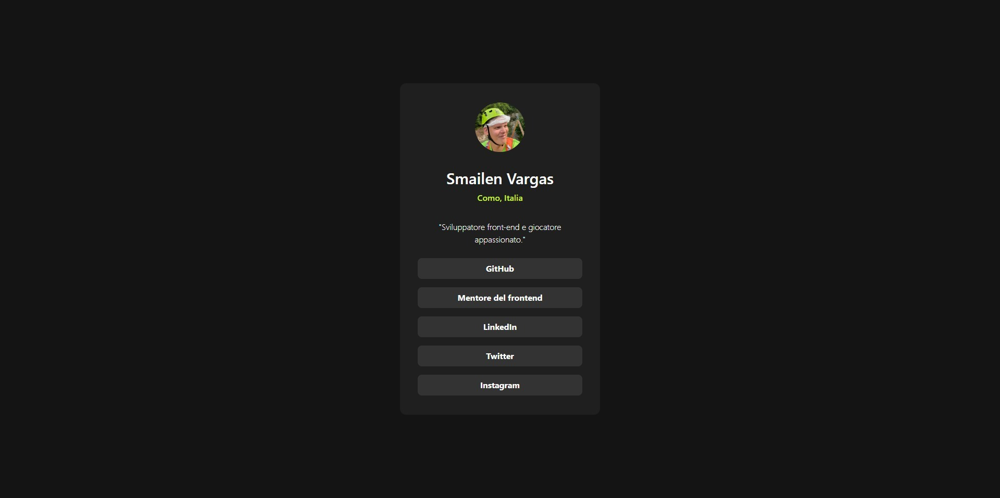

# Social links profile

This is a solution to the [Social links profile challenge on Frontend Mentor](https://www.frontendmentor.io/challenges/social-links-profile-UG32l9m6dQ). Frontend Mentor challenges help you improve your coding skills by building realistic projects. 

## Overview

### The challenge

Users should be able to:

- See hover and focus states for all interactive elements on the page

### Screenshot

### Links

- Solution URL: [solution](https://github.com/Smailen5/Frontend-Mentor-Challenge/tree/main/social-links-profile-main-main)
- Live Site URL: [live site](https://smailen5.github.io/Frontend-Mentor-Challenge/social-links-profile-main-main/)

## My process

### Built with

- HTML5
- Mobile-first workflow
- Tailwind

### What I learned

I've applied what I've learned with Tailwind in my first project, so it's all new to me.

### Useful resources

- [Tailwind documentation](https://tailwindcss.com/docs/hover-focus-and-other-states#hover-focus-and-active) - The only resource I used is the official Tailwind documentation.
- [Where I studied](https://www.youtube.com/playlist?list=PLP5MAKLy8lP9iYl12rUcrYJgKggci5SPn) - I mainly studied following these videos.

## Author

- Website - [Smailen Vargas portfolio](https://smailenvargas.com/)
- Github - [Smailen5](https://github.com/Smailen5)
- Frontend Mentor - [@ Smailen5](https://www.frontendmentor.io/profile/Smailen5)
- Linkedin - [Smailen Vargas](https://www.linkedin.com/in/smailen-vargas/)