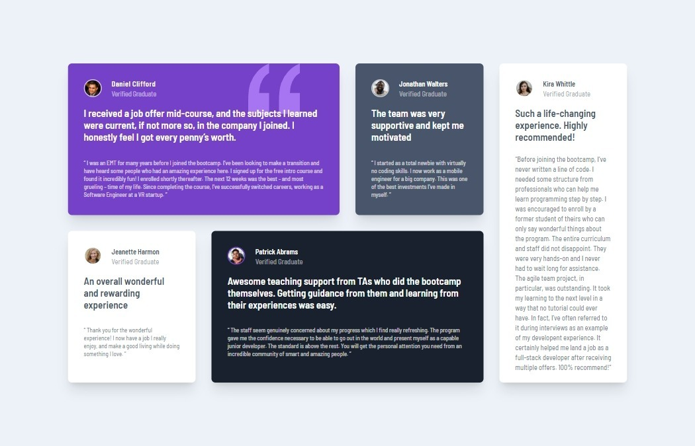

# Frontend Mentor - Testimonials grid section solution

This is a solution to the [Testimonials grid section challenge on Frontend Mentor](https://www.frontendmentor.io/challenges/testimonials-grid-section-Nnw6J7Un7). Frontend Mentor challenges help you improve your coding skills by building realistic projects. 

## Table of contents

- [Overview](#overview)
  - [The challenge](#the-challenge)
  - [Screenshot](#screenshot)
  - [Links](#links)
- [My process](#my-process)
  - [Built with](#built-with)
  - [What I learned](#what-i-learned)
  - [Continued development](#continued-development)
- [Author](#author)


## Overview

### The challenge

Users should be able to:

- View the optimal layout for the site depending on their device's screen size

### Screenshot




### Links

- Solution URL: [Solution](https://github.com/Smailen5/testimonials-grid-section-main)
- Live Site URL: [Live site](https://smailen5.github.io/testimonials-grid-section-main/)

## My process

### Built with

- Semantic HTML5 markup
- CSS custom properties
- Flexbox
- CSS Grid
- Mobile-first workflow


### What I learned

- I've learned to use flexbox in combination with grid.

- I've learned to use Tailwind's `@layer components` to clean up and organize some of the classes used.

```css
@layer components {
    .card {
      color: theme('colors.white');
      border-radius: theme('borderRadius.lg');
      padding: theme('spacing.8');
      box-shadow: theme('boxShadow.xl');
    }
  }
```


### Continued development

- I think in the future I'll need to update the font size to make the layout more similar to the original.


## Author

- Github - [Smailen5](https://github.com/Smailen5)
- Frontend Mentor - [@ Smailen5](https://www.frontendmentor.io/profile/Smailen5)
- Linkedin - [Smailen Vargas](https://www.linkedin.com/in/smailen-vargas/)