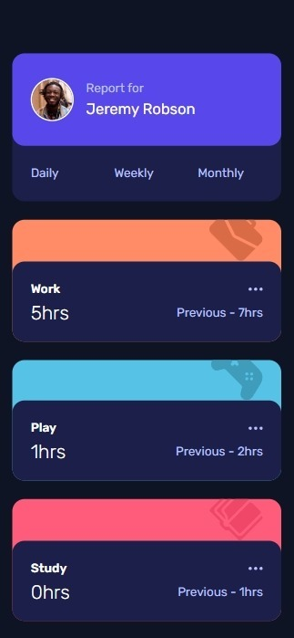
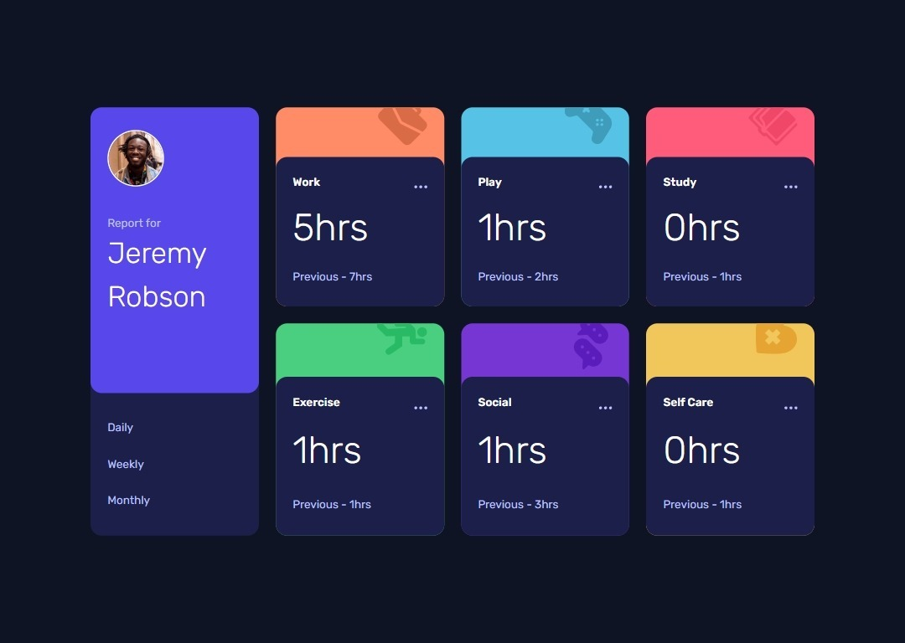

# Time tracking dashboard

This is a solution to the [Time tracking dashboard challenge on Frontend Mentor](https://www.frontendmentor.io/challenges/time-tracking-dashboard-UIQ7167Jw). Frontend Mentor challenges help you improve your coding skills by building realistic projects.


## Overview

### The challenge

Users should be able to:

- View the optimal layout for the site depending on their device's screen size ✔
- See hover states for all interactive elements on the page ✔
- Switch between viewing Daily, Weekly, and Monthly stats ❌

### Screenshot





### Links

- Solution URL: [Solution](https://github.com/Smailen5/Frontend-Mentor-Challenge/tree/main/time-tracking-dashboard-main-main)
- Live Site URL: [Live site](https://smailen5.github.io/Frontend-Mentor-Challenge/time-tracking-dashboard-main-main/)

## My process

### Built with

- HTML5
- Mobile-first workflow
- Tailwind
- Javascript


### What I learned

- I changed the data layout in the card from flex to grid to manage them better in desktop mode:

```html
<div class="grid grid-cols-2 lg:h-full lg:grid-cols-1">
  <div class="col-span-1 lg:col-span-2 lg:w-4/5 lg:row-start-1 lg:col-start-1">
    <h3>Work</h3>
  </div>

  <div class="col-span-1 justify-self-end self-center lg:col-start-2 lg:row-start-1">
    
  </div>

  <div class="col-span-1 lg:col-span-2 lg:row-start-2">
    <p>5hrs</p>
  </div>

  <div class="col-span-1 justify-self-end self-center lg:col-span-2 lg:row-start-3 lg:justify-self-start">
    <p>Previous - 7hrs</p>
  </div>
</div>
```

- To set up the grid correctly as I wanted, I went through trial and error until I found this solution:

```html
<div class="grid grid-cols-2 lg:h-full lg:grid-cols-1">
  <div class="col-span-1 lg:col-span-2 lg:w-4/5 lg:row-start-1 lg:col-start-1">
    <h3>Work</h3>
  </div>

  <div class="col-span-1 justify-self-end self-center lg:col-start-2 lg:row-start-1">
    
  </div>
</div>
```

- I couldn't solve the same bug as in the last exercise; this icon doesn't change color with `fill-white` or `hover:fill-white`. I presume it's an issue with the provided icons.

```html
</div>
```

- I used `change` for the first time to try not to use the usual `click`:

```js
radioButton.addEventListener("change", () => {}
```

- I really don't like this block of code at all; I'll see in the future how I can rewrite it more simply:

```js
function daily(data) {
  workHours.innerText = data[0].timeframes.daily.current + "hrs";
  workPrevious.innerText = `Previous - ${data[0].timeframes.daily.previous}hrs`;
  playHours.innerText = data[1].timeframes.daily.current + "hrs";
  playPrevious.innerText = `Previous - ${data[1].timeframes.daily.previous}hrs`;
  studyHours.innerText = data[2].timeframes.daily.current + "hrs";
  studyPrevious.innerText = `Previous - ${data[2].timeframes.daily.previous}hrs`;
  exerciseHours.innerText = data[3].timeframes.daily.current + "hrs";
  exercisePrevious.innerText = `Previous - ${data[3].timeframes.daily.previous}hrs`;
  socialHours.innerText = data[4].timeframes.daily.current + "hrs";
  socialPrevious.innerText = `Previous - ${data[4].timeframes.daily.previous}hrs`;
  selfCareHours.innerText = data[5].timeframes.daily.current + "hrs";
  selfCarePrevious.innerText = `Previous - ${data[5].timeframes.daily.previous}hrs`;
}
```


### Useful resources

- [StackOverFlow](https://stackoverflow.com/questions/65784357/tailwindcss-change-label-when-radio-button-checked) - I used Stack Overflow to find out how to set radio inputs to not visible. Initially, I tried with `appearance-none`, but they still remain in the flow of the page, so it's better to use `hidden`.


## Author

- Website - [Smailen Vargas portfolio](https://smailenvargas.com/)
- Github - [Smailen5](https://github.com/Smailen5)
- Frontend Mentor - [@ Smailen5](https://www.frontendmentor.io/profile/Smailen5)
- Linkedin - [Smailen Vargas](https://www.linkedin.com/in/smailen-vargas/)

## Attributions

A big shoutout goes to [@Grego14](https://www.frontendmentor.io/profile/Grego14) who gave me good advice both for refactoring the JS code and regarding button listeners.